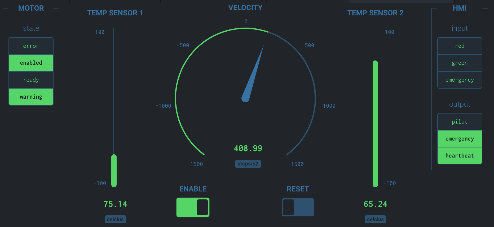
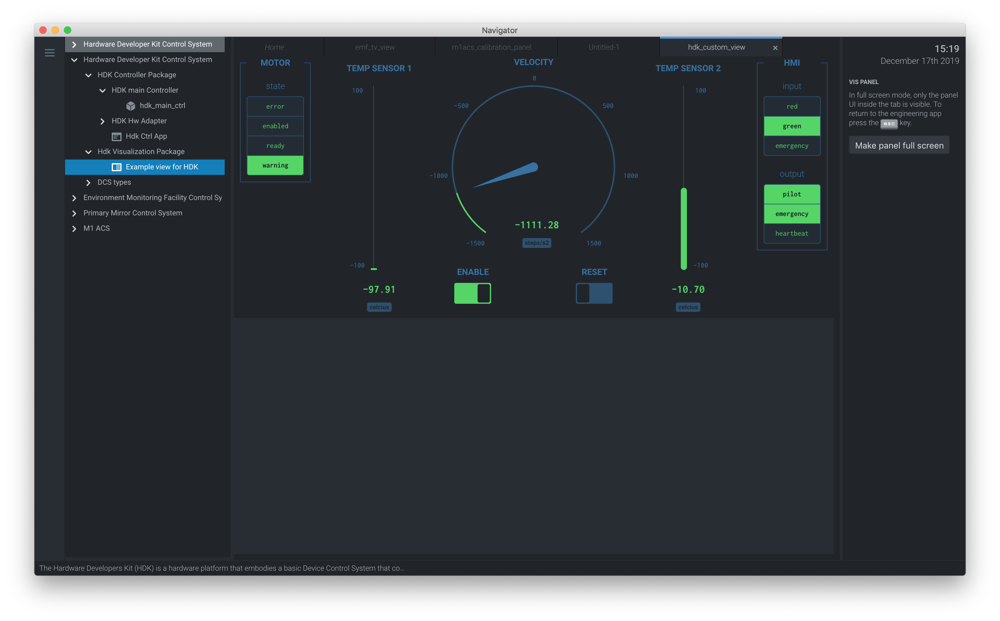

.. _hdk_example:

HDK example
===========

Introduction
------------

The HDK (Hardware Development Kit) is a tool which has the purpose of
serving as a template to facilitate the development of Device Control
Systems (DCS).

HDK Hardware
------------

The main hardware component of the HDK is the control panel, displayed
in :numref:`hdk_main_panel`:

.. _hdk_main_panel:

.. figure:: _static/hdk_hw_panel.png

    HDK Hardware Control Panel

The panel has two DIN rails with all the necessary components. The top rail
contains the power section on the left, an embedded PC in the central part,
and the Ethercat I/O modules on the right (:numref:`hdk_io_modules`),
as well as an emergency button (:numref:`hdk_emergency_button`).
The lower rail contains a stepper motor on the left with a
temperature probe (:numref:`hdk_stepper`), the terminal blocks interface
and a couple of push buttons with a led on the
right side (:numref:`hdk_pushbuttons`).

.. _hdk_io_modules:

.. figure:: _static/hdk_io_modules.png

    HDK I/O modules

.. _hdk_emergency_button:

.. figure:: _static/hdk_emergency_button.png

    HDK emergency button

.. _hdk_stepper:

.. figure:: _static/hdk_stepper.png

    HDK stepper motor

.. _hdk_pushbuttons:

.. figure:: _static/hdk_pushbuttons.png

    HDK pushbuttons

For more details on the HDK
hardware architecture, refer to GMT document GMT-SWC-DOC-00710.

Connection to the DCC
^^^^^^^^^^^^^^^^^^^^^

The HDK can be controlled using its embedded PC, or using a Real Time
Linux DCC. In this example we will use the latter option.

.. note::
    The following instructions assume that the Linux Real Time kernel
    and the Ethercat drivers have been installed in the DCC, according
    to the instructions in the :ref:`Installation Guide document <installation>`.

The EtherCAT bus must be connected to the RJ-45 connector that is located
to the left of the I/O modules block (see :numref:`hdk_ethercat_bus`). The other
end of the bus must be connected to the EtherCAT port of the Real Time Linux
DCC.

.. _hdk_ethercat_bus:

.. figure:: _static/hdk_ethercat_conn.png

    HDK panel EtherCAT bus connection

We can check that the installation has been done correctly using the
```ethercat``` command in the Linux machine. If we execute:

.. code-block:: bash

    $ ethercat slaves

then the returned output must be:

.. code-block:: bash

    0  0:0  PREOP  +  EK1100 EtherCAT-Koppler (2A E-Bus)
    1  0:1  PREOP  +  EL1008 8K. Dig. Eingang 24V, 3ms
    2  0:2  PREOP  +  EL2008 8K. Dig. Ausgang 24V, 0.5A
    3  0:3  PREOP  +  EL3002 2K.Ana. Eingang  +/-10V
    4  0:4  PREOP  +  EL3202 2K.Ana. Eingang PT100 (RTD)
    5  0:5  PREOP  +  EL4032 2K. Ana. Ausgang +/-10V, 12bit
    6  0:6  PREOP  +  EL7041 1K. Schrittmotor-Endstufe (50V, 5A)
    7  0:7  PREOP  +  EL9508 Netzteilklemme 8V
    8  0:8  PREOP  +  EL3356 1K . Ana. Eingang, Widerstandsbr?cke, 16bit, hochgenau
    9  0:9  PREOP  +  EL3356-0010 1K . Ana. Eingang, Widerstandsbr?cke, 24bit, hochge

HDK Software
------------

Clone the hdk_dcs repository
^^^^^^^^^^^^^^^^^^^^^^^^^^^^

On the real-time DCC, clone the repository in the development folder:

.. code-block:: bash

  $ cd $GMT_LOCAL/modules
  $ gds clone hdk_dcs -d gmto

where the ``-d option`` defines the git repository owner. The output of the
command will be:

.. code-block:: bash

    Cloning into 'ocs_hdk_dcs'...
    remote: Counting objects: 548, done.
    remote: Compressing objects: 100% (44/44), done.
    remote: Total 548 (delta 7), reused 19 (delta 1), pack-reused 503
    Receiving objects: 100% (548/548), 97.69 KiB | 1.81 MiB/s, done.
    Resolving deltas: 100% (247/247), done.
    [INF] [gds] clone module hdk_dcs
    [INF] [hdk_dcs] Cloning module: hdk_dcs

Model files
^^^^^^^^^^^

The model files can be found in the **$GMT_LOCAL/modules/ocs_hdk_dcs/model/** folder.

webpack.config.coffee
  It has the `webpack <https://webpack.js.org/>`_ directives which are needed
  to build the model

hdk_dcs_ld.coffee
  It is the "loader" file. It contains the ```require``` directives to load
  the rest of the files.

hdk_dcs.coffee
  Lists the connectors between the components and the external environment.

hdk_dcs_def.coffee
  High-level definition file, representing the WBS for the submodule. It lists
  the components, as well as their implementation language, and other properties.

hdk_dcs_types.coffee
  Definitions of structs and data types used by the HDK components.

hdk_dcs.rst
  Text file, in RST format, describing the module.

hdk_ctrl_pkg/hdk_ctrl_fb.coffee
  Fieldbus definitions for the HDK control package.

hdk_ctrl_pkg/hdk_ctrl_pkg.coffee
  Lists the connectors between the components of the *hdk_ctrl_pkg* package.

hdk_ctrl_pkg/hdk_main_ctrl.coffee
  Definition of the *Main HDK Controller* component. State variables, input and
  output ports are specified here. A single instance called **hdk_main_ctrl**
  will be created.

hdk_ctrl_pkg/hdk_hw_adapter.coffee
  Definition of the *Hardware Adapter* component, used to interface with the HDK
  Actuators and Sensors.
  State variables, input and output ports are specified here.
  A single instance called **hdk_hw1_adapter** will be created.

.. code-block:: bash

             hdk_main_ctrl           hdk_hw_adapter         EtherCAT FB
            +--------------+      +------------------+      +---------+
            |              |      |                  |      |         |
            | hmi_inputs   |<-----| operator_buttons |      |         |
            | motor_state  |<-----| motor_state      |      |         |
            | temperatures |<-----| temperatures     |      |         |
            |              |      |                  |<---->|         |
            | hmi_outputs  |----->| operator_leds    |      |         |
            | motor_ctrl   |----->| motor_ctrl       |      |         |
            | sdo_config   |----->| sdo_in           |      |         |
            |              |      |                  |      |         |
            +--------------+      +------------------+      +---------+

Code generation
^^^^^^^^^^^^^^^

The hdk_dcs repository already has the source code of the HDK, so it is not
necessary to generate it.

If the source code needs to be generated
again (for example, if some feature to the components must be added), then
it can be done using the standard procedure:

.. code-block:: bash

    $ cd $GMT_LOCAL/modules/ocs_hdk_dcs/model
    $ webpack
    $ gds gen hdk_dcs

After re-generating code from the model, all manual changes will need to be re-applied.


Compiling Configuration Files
^^^^^^^^^^^^^^^^^^^^^^^^^^^^^

Configuration files should be compiled for the C++ controllers. This can be done with:

.. code:: bash

    $ gds install  # Copies the configuration file to $GMT_LOCAL/etc/conf/
    $ grs compile hdk_dcs

HDK Main Controller Behavior
^^^^^^^^^^^^^^^^^^^^^^^^^^^^

The behavior of the HDK is defined in the *hdk_main_ctrl* component, and
more specifically, in the step() function of this controller.

The file that contains the HDK controller step function is ```HdkMainCtrl.cpp```.
To visualize or edit it:

.. code-block:: bash

    $ cd $GMT_LOCAL/modules/ocs_hdk_dcs/src/cpp/
    $ cd hdk_ctrl_pkg/hdk_main_ctrl
    $ vi HdkMainCtrl.cpp

The contents of the file is:

.. code-block:: cpp

    #include "HdkMainCtrl.h"

    using namespace std;
    using namespace gmt;

    HdkMainCtrl::HdkMainCtrl(
                            const string& comp_uri,
                            const string& comp_name,
                            const string& comp_host,
                            int comp_port,
                            const string& comp_acl,
                            double comp_scan_rate,
                            int comp_prio,
                            int comp_stack_size)
    : HdkMainCtrlBase(comp_uri, comp_name, comp_host, comp_port, comp_acl, comp_scan_rate, comp_prio, comp_stack_size)
    {
    }

    HdkMainCtrl::~HdkMainCtrl()
    {
    }

    void HdkMainCtrl::step()
    {
        if (!hmi_inputs_val.value.emergency_button)
        {
            motor_ctrl_req.value.velocity = 0;
            motor_ctrl_req.value.enable = false;
        }
        else if (motor_state_val.value.ready && !motor_state_val.value.enabled)
        {
            motor_ctrl_req.value.enable = true; // enable motor if not enabled
        }

        if (motor_state_val.value.enabled)
        {
            if (hmi_inputs_val.value.green_push_button)
                motor_ctrl_req.value.velocity++;
            if (hmi_inputs_val.value.red_push_button)
                motor_ctrl_req.value.velocity--;
            if (!hmi_inputs_val.value.emergency_button)
            {
                motor_ctrl_req.value.velocity = 0;
                motor_ctrl_req.value.enable = false;
            }
        }

        bool moving = motor_state_val.value.moving_positive || motor_state_val.value.moving_negative;
        hmi_outputs_req.value.pilot = moving; // pilot on when moving
        hmi_outputs_req.value.emergency_light = !hmi_inputs_val.value.emergency_button; // ligth on when button pressed
        float estimated_temperature = temperatures_val.value.temp_sensor1 / 10.0;  // 10.0 will be a property

        if (is_step_rate(100))    // every 100 steps = 1 second
        {
            log_info("Green button = " + std::to_string(hmi_inputs_val.value.green_push_button));
            log_info("Red button   = " + std::to_string(hmi_inputs_val.value.red_push_button));
            log_info("Emergency    = " + std::to_string(hmi_inputs_val.value.emergency_button));
            log_info("Temperature  = " + std::to_string(estimated_temperature));
            log_info("Temperature1 = " + std::to_string(temperatures_val.value.temp_sensor1));
            log_info("Temperature2 = " + std::to_string(temperatures_val.value.temp_sensor2));
            log_info("Axis Ready   = " + std::to_string(motor_state_val.value.ready));
            log_info("Axis Enabled = " + std::to_string(motor_state_val.value.enabled));
            log_info("Axis Warning = " + std::to_string(motor_state_val.value.warning));
            log_info("Axis Error   = " + std::to_string(motor_state_val.value.error));
            log_info("Axis Moving+ = " + std::to_string(motor_state_val.value.moving_positive));
            log_info("Axis Moving- = " + std::to_string(motor_state_val.value.moving_negative));
        }

        hmi.value.input = hmi_inputs_val.value;
        hmi.value.output = hmi_outputs_req.value;
        motor.value.state = motor_state_val.value;
        motor.value.command = motor_ctrl_req.value;
        temperatures.value = temperatures_val.value;
    }

    void HdkMainCtrl::setup()
    {
        //setup async input handlers

        //ex: new_async_input_handler ("input_name", this, &HdkMainCtrl::input_handler);

        //add behaviors to features

        //other initializations

    }

This step function has 5 parts:

#. Emergency button
#. Motor control
#. LEDs control
#. Logs
#. Heartbeat LED

Step function. Emergency button section
.......................................

The first code block of the step function is

.. code-block:: cpp

    if (!hmi_inputs.emergency_button)
    {
        motor_ctrl.velocity = 0;
        motor_ctrl.enable = false;
    }
    else if (motor_state.ready && !motor_state.enabled)
    {
        // enable motor if not enabled
        motor_ctrl.enable = true;
    }

In the field ```emergency_button``` of the ```hmi_inputs``` input
port we have the state of the emergency button, in inverse logic
(so it is ``False`` when it is pushed, and ``True`` when not). The
above code block disables the stepper motor and sets the velocity to
0 when the emergency button is activated, and enables the motor
if not.

Step function. Motor control
............................

The next section of code implements the motor control:

.. code-block:: cpp

    if (motor_state.enabled)
    {
        if (hmi_inputs.green_push_button)
        {
            motor_ctrl.velocity++;
        }

        if (hmi_inputs.red_push_button)
        {
            motor_ctrl.velocity--;
        }

        if (!hmi_inputs.emergency_button)
        {
            motor_ctrl.velocity = 0;
            motor_ctrl.enable = false;
        }
    }

In the ```green_push_button``` field of the ```hmi_inputs``` input
port we have the state of the green push button of the HDK panel (``True``
when pushed, ``False`` when not) and in the field ```red_push_button```
we have the state of the red button (see :numref:`hdk_pushbuttons`).

The ```motor_ctrl``` output port has 3 fields: the ```velocity``` field,
which will be forwarded to the stepper motor as the velocity set point; the
```enable```, which will control if the motor is enabled or not; and the
```reset```, which resets the motor in case of failure.

The logic of the section is straightforward: if the green button is pushed,
the velocity will be increased; if the red button is pushed the velocity
will be decreased; and if the emergency button is pushed then the motor is
disabled.

Step function. LEDs control
...........................

The next code section takes care of the control of the LEDs:

.. code-block:: cpp

    bool moving = motor_state.moving_positive || motor_state.moving_negative;
    hmi_outputs.pilot = moving; // pilot on when moving
    hmi_outputs.emergency_light = !hmi_inputs.emergency_button; // ligth on when button pressed

In the fist line we read the motion state of the stepper motor, and in the
second line we light the white led (see :numref:`hdk_pushbuttons`) if the motor is moving. In the third
line, we light the red led (:numref:`hdk_emergency_button`) if the emergency
button is pushed.

Step function. Logs
...................

Once each second, the HDK application produces some logs to inform about
the slaves readings:

.. code-block:: cpp

    if (is_step_rate(100))    // every 100 steps = 1 second
    {
        // following values should go to user interface
        log_info("Green button = " + std::to_string(hmi_inputs.green_push_button));
        log_info("Red button   = " + std::to_string(hmi_inputs.red_push_button));
        log_info("Emergency    = " + std::to_string(hmi_inputs.emergency_button));
        log_info("Temperature  = " + std::to_string(estimated_temperature));
        log_info("Temperature1 = " + std::to_string(temperatures.temp_sensor1));
        log_info("Temperature2 = " + std::to_string(temperatures.temp_sensor2));
        log_info("Axis Ready   = " + std::to_string(motor_state.ready));
        log_info("Axis Enabled = " + std::to_string(motor_state.enabled));
        log_info("Axis Warning = " + std::to_string(motor_state.warning));
        log_info("Axis Error   = " + std::to_string(motor_state.error));
        log_info("Axis Moving+ = " + std::to_string(motor_state.moving_positive));
        log_info("Axis Moving- = " + std::to_string(motor_state.moving_negative));
    }

The ```is_step_rate(num)``` function returns true once each ```num``` steps, so the
above code gets executed once each 100 steps. As the HDK scan rate is 100 Hz,
this section is entered once each second.

Inside the *if* statement we have several ```log_info``` to show the different
variables. The ```log_info``` method is inherited from the *BaseComponent* base
class, and it sends the given string to the Log Service.

Step function. Heartbeat LED
............................

Finally, the section

.. code-block:: cpp

    if(is_step_rate(500))  // every 500 steps = 5 seconds
    {
        // flip bit to indicate component is alive
        hmi_outputs.heartbeat = !hmi_outputs.heartbeat;
    }

inverts the state of the heartbeat LED, with a period of 5 seconds. This
digital output is not actually wired to any hardware device, but the
change is visible in the LED array of the digital output EL2008 Ethercat slave.

Compilation
^^^^^^^^^^^

To compile the C++ Control Package code of the HDK, edit the module.mk file to
contain the correct library definitions:

.. code-block:: bash

   $ vi $GMT_LOCAL/modules/ocs_hdk_dcs/src/cpp/hdk_ctrl_pkg/module.mk

Ensure that the following lines are defined:

.. code-block:: bash

   # Add in this file the compile flags for the package, eg:
   MOD_BUILD_LDFLAGS += -lcore_core_pkg -lio_core_pkg -lctrl_core_pkg -lio_ethercat_pkg
   MOD_BUILD_LDFLAGS += -lethercat

Run **make** to compile the code:

.. code-block:: bash

   $ cd $GMT_LOCAL/modules/ocs_hdk_dcs/src/cpp
   $ make

Running the Example
^^^^^^^^^^^^^^^^^^^
Start the logging and telemetry services:

.. code-block:: bash

   $ log_server &
   $ tele_server &

Start the HDK application in the background

.. code-block:: bash

   $ hdk_ctrl_app &

The application is running in the background and will not provide any console output.
All output will be directed to the logging service after the components have been successfully set up.

Log client
...........

In a separate terminal (for example, `tty2`), **start the logging service client**.

.. code-block:: bash

   $ log_client listen


Telemetry client
................

In a separate terminal (for example `tty3`), **start the telemetry service client**.

.. code-block:: bash

  $ tele_client listen


HDK operation
.............

Now the HDK is available to be operated. The behaviour of the system
will be the described one:

* If the emergency button is pressed, then the stepper motor will be
  disabled, and the red led of the emergency button will be on.
* If the emergency button is released, then the stepper motor will be
  enabled, and the red led of the emergency button will be off.
* When the emergency button is released, if the green button is pushed
  then the velocity of the stepper motor will be increased.
* When the emergency button is released, if the red button is pushed
  then the velocity of the stepper motor will be decreased.
* If the motor is moving, then the pilot led between the buttons will
  be on.

User Interface
--------------

The Navigator application displays the Engineering user interface as well as any
custom panels defined in the subsystem's Visualization Package.



The above image shows the HDK DCS' UI contained in the visualization package.
This is a basic example of what's possible to do in a visualization package.
More detailed examples will be added in the future as the UI Framework matures.

Configuration
^^^^^^^^^^^^^

The Navigator app uses your bundles and configuration to connect to your DCS components.  If your component instance is running on a different machine, you will need to update your configuration files in ``$GMT_LOCAL/etc/conf`` to point to the IP address of the target computer. You can quickly udpate all your config IPs like so:

.. code-block:: bash

    $ cd $GMT_LOCAL/etc/conf/hdk_ctrl_pkg/hdk_main_ctrl/
    $ sed -i '' "s/172.0.0.1/172.16.10.31/g" hdk_main_ctrl_config.coffee

Also note that the firewall on the target machine will need to be configured to allow data through port range used by your component instance.  You can use the ``firewall-cmd`` to open the applicable ports (for example, the range from 8122 to 8124):

  .. code-block:: bash

     $ sudo firewall-cmd --add-port=8122-8124/tcp

See the Troubleshooting section in the :ref:`UI Framework Guidelines document <ui_fwk>` for more help with connection issues.

Running the Engineering UI
^^^^^^^^^^^^^^^^^^^^^^^^^^

The Navigator app uses your local bundles file (found in ``$GMT_LOCAL/etc/bundles``) to automatically create
a visual representation of your model.



The model is shown as a navigation tree.  In the above image, the ``hdk_custom_view`` panel shown.  For more information on creating custom UI panels, see the :ref:`UI Framework Guidelines document <ui_fwk>`.

To launch the visualization panel, find the `> Hdk Visualization Package > Example view for HDK` visualization panel in the menu and select it.  This will create a new tab in Navigator showing the panel.

.. note::

    The HDK UI package needs to exist in your ``$GMT_LOCAL/lib/js`` folder in order for Navigator to load it.  This might be a separate download.
