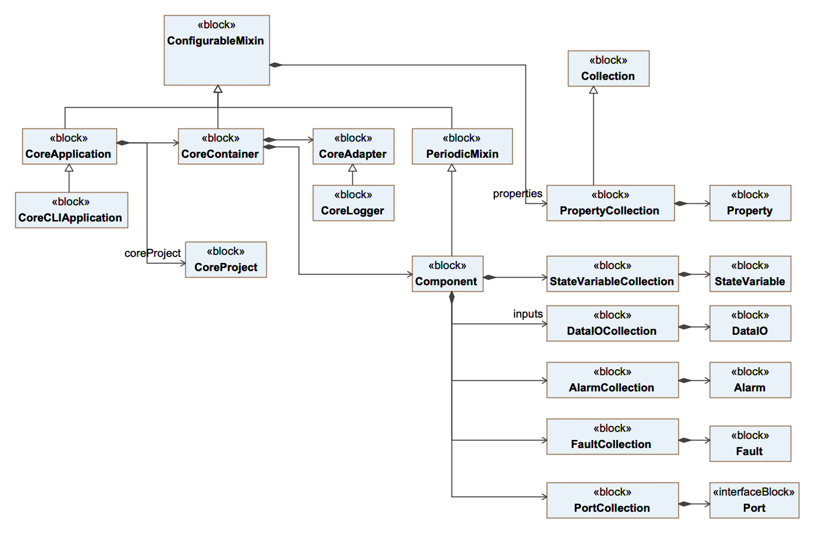
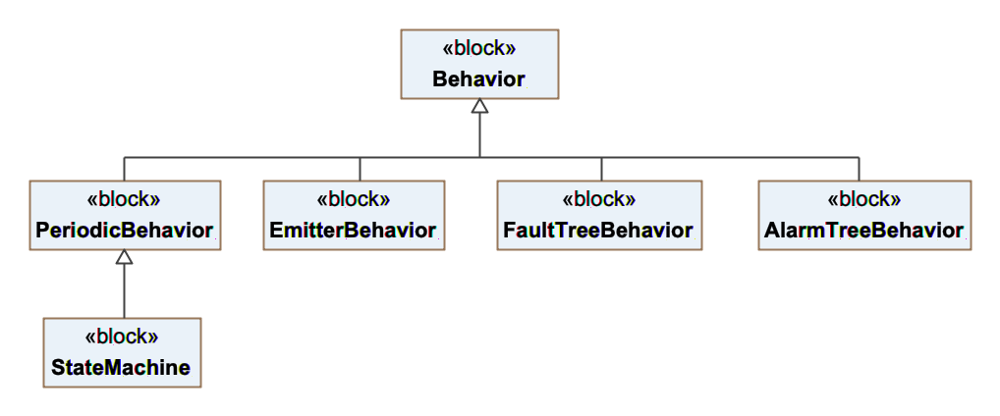
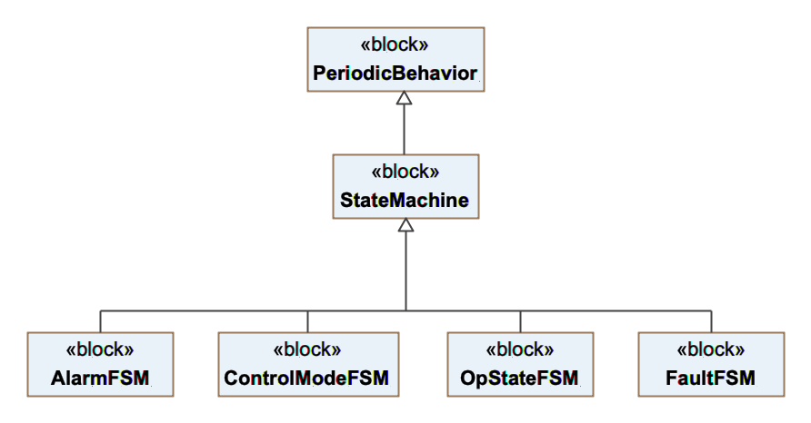
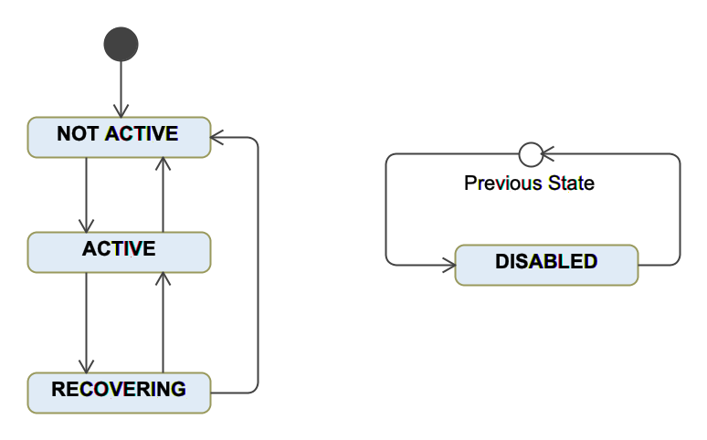
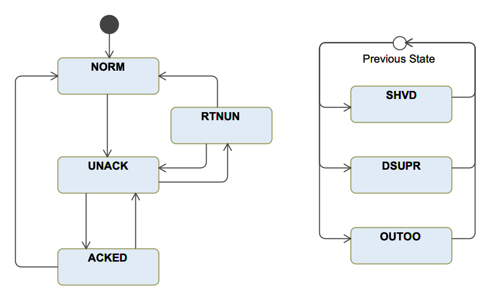
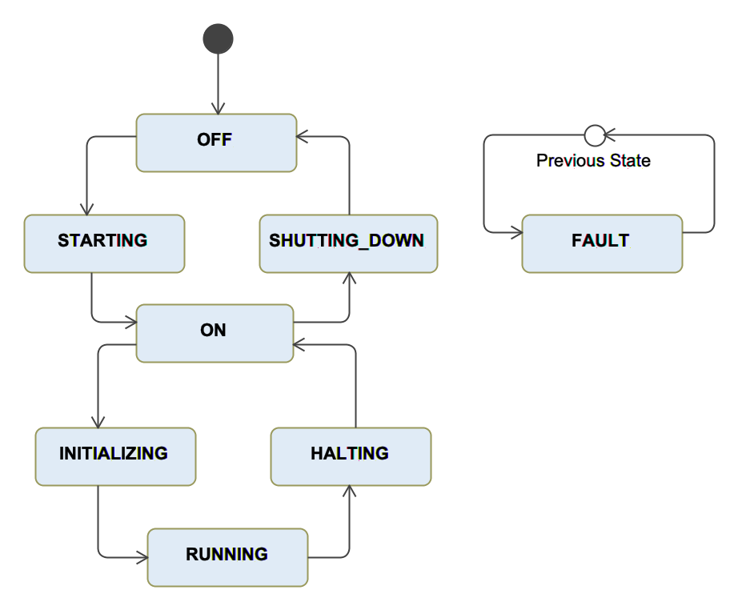

.. _mapping_model_to_coffee:

Mapping between the Model Definition Files and Coffeescript source code
------------------------------------------------------------------------

Introduction
............

The following guide describes how the model definitions are mapped into a
`Coffeescript programming language <https://coffeescript.org>`_ implementation that executes in the
`nodejs <https://nodejs.org>`_ platform. The OCS SDK provides a code generator (as part of the
:ref:`gds <gds_guide>` tool that thansforms the model specification into a set of
programs that take advantage of the core framework API to
access the OCS distributed infrastructure as well as the OCS Core Services.
In addition to execute in the nodejs runtime, the generated programs
run also in the electron-js environment as long as the core framework API is used on the node side.

The nodejs **OCS Core Framework** takes advantage of the nodejs
asynchronous event loop and is well suited for
(a) components that required distributed asynchronous communication (e.g.
the :ref:`OCS Core Services <core_services_usr_guide>` are implemented this way); (b) components
that are part of the OCS user interface that runs in the electron platform;
(c) applications that don't require high performace computations or communications and
that will benefit from an implementation in a dynamic typed language.

The mapping between the model definition of a Component and its implementation in the 
nodejs/Coffeescript platform is the most direct transformation of the platforms
supported by the OCS development system (nodejs, cpp, python). Most of the modeling concepts
have a one to one correspondace in the Core Framework. The cases where there are discrepancies are noted
in this document.

.. note::

    The use of nodejs allows access to a rich ecosystem of node modules, however
    any node module not distributed as part of the OCS SDK should require
    approval from the GMT PO.

NodeJS file tree structure
..........................

As described in the :ref:`gds gen command <gds_gen>` a coffeescript implementation
for those components whose target list contains ``coffee`` in its target attribute
is generated.  The source files generated are created under
the :code:`<MODULE_DIR>/src/coffee` directory, which has the following structure::

   <MODULE_DIR>/
      |-- ...
      |-- src/
            |-- ...
            |-- bin/
            |    |-- <app_1>
            |    |-- ...
            |    |-- <app_n>
            |
            |-- coffee/
            |    |-- <pk_1_pkg>/
            |    |-- ...
            |    |-- <pk_n_pkg>/
            |    |
            |    |-- Makefile
            |    |-- webpack.config.coffee
            |--etc/conf/
            |    |-- <pk_1_pkg>/
            |    |-- <module_name>_ld.coffee

Model elements are processed differently depending on the value of their
``build`` attribute and on the model element class.

- When then model element class is ``Application`` and the ``build`` attribute value is ``app``
  an application bootstrap file will be created in ``<MODULE_DIR>/src/bin`` and an application
  skeleton file will be created in the corresponding package directory ``<MODULE_DIR>/src/coffee/<pkg>``.
  By default, the application skeleton creates an instance of every Component in the package.
  The section :ref:`Applications <application>` includes an example of a generated application.

- When the model element class or superclass is ``Component`` and the ``build`` attribute value is
  ``dist`` two files will be created in ``<MODULE_DIR>/src/coffee/<pkg>/<component>``:

  - A *Component* source file with an skeleton of the component implementation
  - A demo *Application* that creates an instance of the component and that
    allows to start and test the component. Section :numref:`component`
    includes an example of a generated component.

- When the model element class or superclass is ``Component`` and the ``build`` attribute value is
  ``test`` two files will be created in ``<MODULE_DIR>/src/coffee/<pkg>/<component>``:

  - A *Component* source file with an skeleton of the component implementation
  - A demo *Application* that creates an instance of the component and that
    allows to start and test the component. Section :numref:`component` includes
    an example of a generated component. *TODO*

- When the model element class or superclass is ``Component`` and the ``build`` attribute value is
  ``example`` two files will be created in ``<MODULE_DIR>/src/coffee/<pkg>/<component>``:

  - A *Component* source file with an skeleton of the component implementation
  - A demo *Application* that creates an instance of the component and that
    allows to start and test the component. Section :numref:`component` includes
    an example of a generated component. *TODO*

Webpack files
^^^^^^^^^^^^^

`Webpack <https://webpack.js.org>`_ is used to process and optimize Coffeescript files.
The behavior of the webpack tool is taylored by means of a configuration file: *webpack.config.coffee*
that is created by the code generator. The webpack configuration file works in the following way:

- A library is created for each *Package* and installed in ``$GMT_LOCAL/lib/js``
- An application executable is created for each *Application* and is installed in ``$GMT_LOCAL/bin``
- Tests defined in the directory ``<module_name>/test`` are installed in ``GMT_LOCAL/test/<module_name>``

The following code shows an example of the webpack configuration file

.. code-block:: coffeescript

    path          = require 'path'
    _             = require 'lodash'

    local_path    = process.env.GMT_LOCAL
    global_path   = process.env.GMT_GLOBAL

    [base_config] = require "#{global_path}/etc/webpack/webpack.base"
    project_name  = "ocs"
    module _name   = "isample_dcs"

    lib_config =
        name:   "lib"
        entry:
            isample_ctrl_pkg:        "./isample_ctrl_pkg/isample_ctrl_pkg.coffee"
        output:
            filename:          "#{project_name}_#{module_name}_lib.js"
            path:              path.resolve local_path, 'lib/js'
            libraryTarget:     'umd'
            library:           module_name

    _.extend lib_config,  base_config

    app_config =
        name:   "app"
        entry:
            isample_main_app:        "./isample_ctrl_pkg/IsampleMainApp.coffee"
        output:
            filename:         "[name]_lib.js"
            path:             path.resolve local_path, 'lib/js'

    _.extend app_config,  base_config

    module.exports = [lib_config, app_config]

Data Types Mapping
..................

Coffeescript is a dynamically typed language that doesn't provide type
declarations. Primitive Types are the same ones as the Javascript language.
*StructType* types defined in the model could be implemented as object literals or as a class.
The code generator doesn't make a choice and *StructType* class declarations are
not generated. For those *Component* features whose model type is *StateMachine*
the code generator creates an skeleton of the *StateMachine* implementation.

Component Features
..................

:ref:`Components <dcs_component_architecture>` are the main building block of the OCS architecture.
The following diagram shows an overall view of the Core Framework main classes.

  Core Framework main classess

A Component has the following features:

- Properties: Collection of Properties. See the :ref:`properties section <properties>` in the :ref:`model specification guide <modeling_guidelines>` for the attributes of a *Property*
- Inputs: Collection of DataIO. See the :ref:`input ports section <inputs>` in the :ref:`model specification guide <modeling_guidelines>` for the attributes of an *Input*
- Outputs: Collection of DataIO. See the :ref:`output ports section <outputs>` in the :ref:`model specification guide <modeling_guidelines>` for the attributes of an *Output*
- State Variables: Collection of State variables. See the :ref:`state variables section <state_vars>` in the :ref:`model specification guide <modeling_guidelines>` for the attributes of a *StateVariable*
- Faults: Collection of Faults. See the :ref:`faults section <faults>` in the :ref:`model specification guide <modeling_guidelines>` for the attributes of a *Fault*
- Alarms: Collection of Alarms. See the :ref:`alarms section <alarms>` in the :ref:`model specification guide <modeling_guidelines>` for the attributes of an *Alarm*

.. note::

    Note that ``input_ports`` and ``ouput_ports`` from the Model
    are mapped into ``inputs`` and ``ouputs`` in the Core Framework

.. figure:: _static/Data_IO.png
  :align: center
  :scale: 60 %
  :alt: Data inputs and outputs

  Data inputs and outputs

Each Component implementation class inherits from the Core Framework
*Component* class. Each of the features is implemented as a *Collection*.
(see diagram). All the collections include partially applied functions
to manipulate each collection. The following fragment of code shows some
examples.

.. code-block:: coffeescript

    # prints the name of all the inputs
    @inputs.each (i) -> console.log i.name

    # returns an array with the names of all the state variables that are controllable
    @state_vars
        .filter (s) -> s.is_controllable
        .map    (s) -> s.name

    # returns true if there is at least one fault active, otherwise returns false
    @faults
        .some   (f) -> f.is_active

The implementation of these methods is based on the `lodash <https://lodash.com>`_ library
and includes the most common methods to support functional programming.

Communication between Components
................................

*Components* can communicate with each other by means of :ref:`Connectors <data_connector_def>`.
A *Connector* specification includes the definition of the *Connector* endpoints (*to* and *from*).

If the ``blocking_mode`` of a port is *'sync'* the information will be transmitted from
the ``from`` endpoint to the ``to`` endpoint at the rate specified by the ``nom_rate`` attribute of
the connector.

In case no ``url`` attribute is defined in the port specification the communication 
between components will be implemented using service ports. *Service ports* are created
by default for every *Component* and allow to exchange information with it. The :ref:`grs set <grs_set>`, :ref:`grs get <grs_get>` and
:ref:`grs inspect <grs_inspect>` commands use *Service Ports* to access the information of a running *Component*.

If the ``blocking_mode`` of a port is *'async'* the Core Framework provides the *ComponentProxy* class to
allow communicating with a remote *Component*. The following segment of code demonstrates the use
of the *ComponentProxy* methods.

.. code-block:: coffeescript

    # Imports ComponentProxy from the core framework
    {ComponentProxy} = require 'ocs_core_fwk'

    proxy = new ComponentProxy {name: 'position_ctrl'}

    position = proxy.get 'state_vars/position/value'

    proxy.set 'state_vars/position/goal', 200

Component Behaviors
...................

*Components* implement their control, monitoring and supervisory
functions by specializing their :ref:`step <step_std>` function.
The step function can be considered as a non side effect function ``fstep: (I, S) -> O``
taking the current *inputs* and state (as represented by *state variables*)
of a *Component* and generating a new set of *outputs* that produce
an effect on the context of a *Component* (e.g. other connected
components or the system under control via the hardware adapters).

  Component default behaviors

In many cases the step function may be enough to implement all the functions allocated
to a *Component*. However, in some cases it may be useful to organize
the functions of a *Component* in a modular way, specially if the
functions are complex. A *Behavior* is the modular functional unit
to organize the complexity of a *Component*. *Behaviors* must implement
an ``apply`` function. The ``apply`` function is invoked by the
Core Framework at the scan rate of the *Component* (as defined by the ``scan_rate``
property. In case the *Behavior* requires to be executed at a different rate from the scan rate
the *PeriodicBehavior* class can be used, in which case a rate attribute
can be defined when created an instance (see following example).

.. code-block:: coffeescript

    # Imports Behavior from the core framework
    {Behavior, PeriodicBehavior} = require 'ocs_core_fwk'

    class NewBehavior extends Behavior

        apply: (d, dt) ->
            # Behavior function

    class NewPeriodicBehavior extends PeriodicBehavior

        apply: (d, dt) ->
            # Behavior function

    bh = new NewBehavior {name: 'behavior_name'}
    bhp = new NewPeriodicBehavior {name: 'behavior_name', rate: 10}

    @state_vars.position.behaviors.add bh
    @state_vars.position.behaviors.add bhp

    bh.setup()
    bhp.setup()

It's possible to define input and output parameters as part of a behavior
specification. This allows to compose them following the
structure that suits the decomposition of the problem by connecting
the *Behaviors* inputs and outputs. A common structure is
a control or supervisory hierarchy.

*Behaviors* can be attached to the *Component* context or to any
of the *Component* features (e.g. state variable, faults, alarms).
The control functions may be of discrete (e.g. a state machine)
or continuous nature (e.g. a PID loop). In hybrid control systems
both types of functions are present.

Continuous functions will often involve the application of a set
of mathematical operations and are mostly specific to the application'
domain.

State Machines
..............

In case of discrete functions that could be modeled as an state machine,
the core framework includes a *StateMachine* class with the following characteristics:

- Supports Moore and Mealy machines
- Reactive evaluation like other Component Behaviors
- Full access to *Component* state and *Core Services* through ``@ctx`` reference
- Can be composed to create arbitrary large hierarchical and parallel machines (StateCharts)
- Allow each individual State Machine to be tested individually
- Arbitrary composition of hybrid control architectures (continuous and discrete behavior) inside each component

State Machines can be defined by specializing the *StateMachine* class from
the core framework by the following means:

- Defining a transition function ``ft: (I,S) -> S`` that takes as arguments
  the inputs and current state and determines the next state
- Defining an ouput function ``fo: (I,S) -> O`` that takes as arguments the
  inputs and current state and updated the output of the *StateMachine*
- Defining the following functions for each of the states:

  - An ``entry`` function that is executed when the state is entered
  - An ``exit`` function that is executed when the state is exited
  - An ``on`` function that is executed every time the *StateMachine* is
    evaluated and is in the present state

The following diagram shows some of the core framework builtin state machines.

  Core framework builtin state machines

Fault management
^^^^^^^^^^^^^^^^

The previous section describes some strategies to implement the control, monitoring
and supervisory functions of a *Component*. In addition to these functions
control systems that require to exhibit robustness and reliability must address
the detection and management of non-nominal operating conditions. Often
the strategy for addressing fault management doesn't necessary follows the structure
of the control function, in which case it is convenient to have an independant
implementation.

The Core Framework allows the definition of the faults that a *Component* may
handle. For each *Fault* an ``eval`` function can be defined to detect if the
fault condition is active. Additionally, in cases in which an strategy can be
establised to handle the fault condition a ``recover`` function can be defined.
Each *Fault* is associated by default with a fault state machine (``FaultFSM``)
that governs the transitions between fault states as described
in the following diagraman.

  Fault State Machine

As described in the :ref:`*Faults* <faults>` section of
the :ref:`model specification guide <modeling_guidelines>` *Faults*
can be organized as a fault tree to model more complex fault states.
The next segment of code shows an example of a fault specification.

.. code-block:: coffeescript

    # prints the name of all the inputs

    faults:
        axis_fault:
            name:          'axis_fault'
            kind:          'or'
            parent:        ""
            level:         'CRITICAL'
            default_value: 'NOT_ACTIVE'
            desc:          'Axis Controller not operational'}
            detection_latency: 1

        motor_over_heat:
            name:          'motor_over_heat'
            kind:          'primary'
            parent:        'axis_fault'
            level:         'CRITICAL'
            default_value: 'NOT_ACTIVE'
            desc:          'Motor Overheat'
            detection_latency: 1

        encoder_fault:
            name:          'encoder_fault'
            kind:          'primary'
            level:         'CRITICAL'
            parent:        'axis_fault'
            default_value: 'NOT_ACTIVE'
            desc:          'Encoder not responding'
            detection_latency: 1

        motor_fault:
            name:          'motor_fault'
            kind:          'primary'
            level:         'CRITICAL'
            parent:        'axis_fault'
            default_value: 'NOT_ACTIVE'
            desc:          'Motor not responding'
            detection_latency: 1

Alarm management
^^^^^^^^^^^^^^^^

*Alarms* are used to notify operators of operating conditions that
require their attention. The Core Framework allows to define which
*Alarms* are associated with a *Component*. For each *Alarm* an
``eval`` function has to be defined to determine if an alarm condition
is active. As described in the :ref:`*Alarms* <alarms>` section
of the :ref:`model specification guide <modeling_guidelines>` *Alarms*
can be arranged, grouped and connected in a similar way to fault trees.

Although the implementation mechanism is similar, *Faults* and *Alarms* have
different functions are their logic is independed, although in some
cases the occurence of a *Fault* condition of the inability to
recover from a *Fault* condition may require the activation of
an *Alarm* condition. Once an *Alarm* condition occurs the alarm
follows a life-cycle similar to the one defined in the `IEC62682
*Management of alarm system for the process industries*
standard <https://en.wikipedia.org/wiki/IEC_62682>`_.

In the Core Framework the life-cycle of an alarm is implemented
in the *AlarmFSM* state machine as described in the following diagram.

  Alarm State Machine

Component Operational State
^^^^^^^^^^^^^^^^^^^^^^^^^^^

*Components* include an operational state *StateVariable* that governs
the life-cycle of each *Component*. This life-cycle is implemented in the
*StateMachine* *Behavior* ``OpStateFSM`` as described in the following diagram:

  Operational State State Machine

The following table describes the behavior of the *Component* in each
possible state.

   ==============   ==========================================================
     Method          Description
   ==============   ==========================================================
   OFF               Initial state
   STARTING          Auto transition to ON if auto_start is true
   ON                Enables input and output behaviors
   INITIALIZING      Enables property, state_var, alarms and fault behaviors
   RUNNING           Set state variables following_mode to 'FOLLOWING'
   HALTING           Set state variables following_mode to 'NOT_FOLLOWING'
   SHUTTING_DOWN     Disables input and output behaviors
   FAULT             State variables are set to 'NOT_FOLLOWING'
   HALTING           Disables property, state_var, alarms and fault behaviors
   ==============   ==========================================================

Component Health Supervision
^^^^^^^^^^^^^^^^^^^^^^^^^^^^

The core framework includes a default health supervisory behavior
*HealthSupervisingBehavior* that implements a basic supervisory function
which allows:

- Detecting if a supervised *Component* is able to respond to a ``ping`` message, otherwise
  it will assert the fault ``<supervisee>_not_responding``
- Detecting if a supervised *Component* ``op_state`` state variable is ``RUNNING``, otherwise
  it will assert the fault ``<supervisee>_not_operational``

The following segment of code shows an example of how to define a health supervisory behavior

.. code-block:: coffeescript

    # Example of HealthSupervisingBehavior declaration

    stage_sup.behaviors.add new HealthSupervisingBehavior {name: 'sup_bh'}

    stage_sup.add_supervisee {name: 'x_ctrl',         conf: x_ctrl.file_conf}
    stage_sup.add_supervisee {name: 'y_ctrl',         conf: y_ctrl.file_conf}
    stage_sup.add_supervisee {name: 'z_ctrl',         conf: z_ctrl.file_conf}
    stage_sup.add_supervisee {name: 'cartesian_ctrl', conf: cartesian_ctrl.file_conf}
    stage_sup.add_supervisee {name: 'thermal_ctrl',   conf: thermal_ctrl.file_conf}

.. _application:

Applications
............

The Core Framework allows implementing end applications, which
eventually will be transformed in an executable using the *CoreApplication*
class. The *CoreApplication* class has the following characteristics:

- Instantiates a *CoreContainer* that allows the *Component* to use
  the OCS Core Services
- Instantiates the indicated *Component* instances
- The *CoreCLIApplication* class in addition allows the management of
  command line options.

The following code shows an example of an application as produced by the
code generator.

.. code-block:: coffeescript

    { CoreContainer
    Supervisor
    HealthSupervisingBehavior
    CoreCLIApplication } = require 'ocs_core_fwk'
    {IsampleCtrlSuper}   = require './isample_ctrl_super/IsampleCtrlSuper'
    {IsampleTempCtrl}    = require './isample_temp_ctrl/IsampleTempCtrl'
    {IsampleFocusCtrl}   = require './isample_focus_ctrl/IsampleFocusCtrl'
    {IsampleFilterWheelCtrl} = require './isample_filter_wheel_ctrl/IsampleFilterWheelCtrl'
    {IsampleHwAdapter}   = require './isample_hw_adapter/IsampleHwAdapter'

    class IsampleCtrlPkgApp extends CoreCLIApplication

        setup: ->
            @ctnr = new CoreContainer @, null,
                name:    "isample_ctrl_pkg_app_container"
                scope:   @properties.scope.value
                logging: @properties.logging.value

            @ctnr.create_adapters()

            @isample_ctrl_super = new IsampleCtrlSuper @ctnr, null,
                name:    'isample_ctrl_super'
                scope:   @properties.scope.value
                logging: @properties.logging.value

            @isample_cryo_internal_temp_ctrl = new IsampleTempCtrl @ctnr, null,
                name:    'isample_cryo_internal_temp_ctrl'
                scope:   @properties.scope.value
                logging: @properties.logging.value

            @isample_cryo_external_temp_ctrl = new IsampleTempCtrl @ctnr, null,
                name:    'isample_cryo_external_temp_ctrl'
                scope:   @properties.scope.value
                logging: @properties.logging.value

            @isample_focus1_ctrl = new IsampleFocusCtrl @ctnr, null,
                name:    'isample_focus1_ctrl'
                scope:   @properties.scope.value
                logging: @properties.logging.value

            @isample_fw1_ctrl = new IsampleFilterWheelCtrl @ctnr, null,
                name:    'isample_fw1_ctrl'
                scope:   @properties.scope.value
                logging: @properties.logging.value

            @isample_fw2_ctrl = new IsampleFilterWheelCtrl @ctnr, null,
                name:    'isample_fw2_ctrl'
                scope:   @properties.scope.value
                logging: @properties.logging.value

            @isample_hw1_adapter = new IsampleHwAdapter @ctnr, null,
                name:    'isample_hw1_adapter'
                scope:   @properties.scope.value
                logging: @properties.logging.value

            @sup = new Supervisor @ctnr, null, {name: "isample_ctrl_pkg_super"}  # Default supervisor, substitute by pkg supervisor

            @sup.behaviors.add new HealthSupervisingBehavior {name: 'sup_bh'}

            @sup.add_supervisee {name: 'isample_ctrl_super'}
            @sup.add_supervisee {name: 'isample_cryo_internal_temp_ctrl'}
            @sup.add_supervisee {name: 'isample_cryo_external_temp_ctrl'}
            @sup.add_supervisee {name: 'isample_focus1_ctrl'}
            @sup.add_supervisee {name: 'isample_fw1_ctrl'}
            @sup.add_supervisee {name: 'isample_fw2_ctrl'}
            @sup.add_supervisee {name: 'isample_hw1_adapter'}

            super() if super.setup

    app = new IsampleCtrlPkgApp null,
        name:    "isample_ctrl_pkg_app"
        scope:   "local"
        logging: "info"

    app.setup()
    app.start()

Command line options
^^^^^^^^^^^^^^^^^^^^

The Core Framework makes every property of a *Component* available
as a command line option. The following example shows an example
in which the ``logging`` property of an application is propagated
to other instances created by the application.

.. code-block:: coffeescript

        class TestApp extends CoreCLIApplication

            setup: ->
                @ctnr = new CoreContainer @, null,
                    name:    "test_app_container"
                    scope:   @properties.scope.value
                    logging: @properties.logging.value

                @ctnr.create_adapters()

                @comp = new Component @ctnr, null,
                    name:    'my_component'
                    scope:   @properties.scope.value
                    logging: @properties.logging.value

                @sup = new Supervisor @ctnr, test_sup_conf,
                    name:    "my_super"
                    scope:   @properties.scope.value
                    logging: @properties.logging.value

                @sup.behaviors.add new HealthSupervisingBehavior {name: 'super_sup_bh'}

                @sup.add_supervisee {name: 'my_component'}

                super() if super.setup

        app = new TestApp null,
            name:    "test_app"
            scope:   "global"
            logging: "metric"

        app.setup()
        app.start()

.. code-block:: bash

    # when invoking the application we will enter in the shell:
    > my_app --logging debug

Core Service adapter API
........................

*Components* run inside a container that manages their life-cycle
and provides access to the interface with the Core Services.
The Core Framework includes two default container classes:

- *CoreContainer*: Implements the complete interfaces with the Core Services, but
  instead of sending the information to the Core Service servers it is directed to the
  terminal standar ouput. This is useful for quick feedback on the developement of a
  *Component* as there is no need to have an instance of the Core Services running
- *CoreServiceContainer*: Implements the complete interface with the Core Services and
  integrates the information generated by the *Component* with them.

- The interface with the Core Services is implemented by means of a set of
  service adapters

   =======     ======================
   Adapter     Service
   =======     ======================
   ``log``     Logging Service
   ``tele``    Telemetry Service
   ``conf``    Configuration Service
   ``alarm``   Alarm Service
   ``sup``     Supervisory Service
   =======     ======================

Although all services can be accesed from a component (e.g. ``@log``, ``@tele``).
The most common use cases are already implemented by the defatul behaviors of
the Core Framework:

    - The *SamplingBehavior* samples the *Component* features at the defined rate
      and sends the information to the Telemetry Service
    - The FaultFSM and AlarmFSM state machines send information to the corresponding
      services when the associated *Fault* and *Alarm* state variables transition
      from one state to another.
    - The *Configuration Service* adapter sends a configuration event message
      when properties change once the execution of a *Component* has started.

The Logging Service is the most likely beeing used by the developer when
implementing the functions of a component

Logging Service Adapter
^^^^^^^^^^^^^^^^^^^^^^^

The following segment of code demonstrate the use of the 
Logging Service adapter interface. The logging functions
are consisten with the :ref:`logging levels <logging>` as defined
in the grs command.

The syntax of the loggin API is:

``<log_adapter_reference>.<logging function>   <contex>, <message>``

.. code-block:: coffeescript

    # Log adapter info example
    @log.fatal   @, "Fatal log message"
    @log.error   @, "Error log message"
    @log.warning @, "Warning log message"
    @log.info    @, "Informative log message"
    @log.debug   @, "Debug log message"
    @log.trace   @, "Trace log message"
    @log.metric  @, "Metric log message"

When setting the ``logging`` property of a *Component* only
those messages whose level of detail is the same or lower will
be directed to the Logging Service. For example if ``logging = 'info'``
only messages of type ``fatal``, ``error``, ``warning`` and info
will be send.

Development Example
...................

TBD
