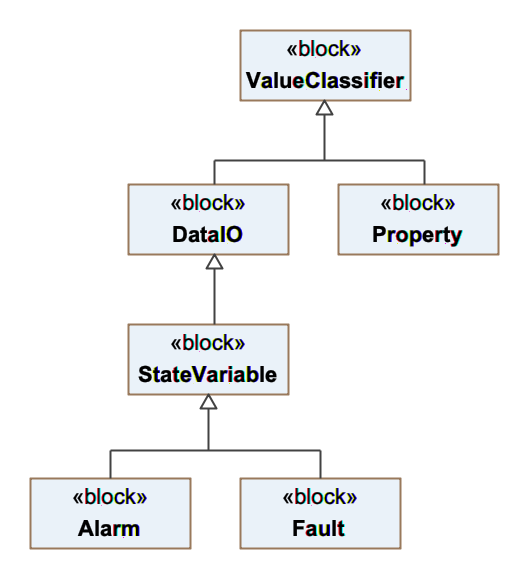
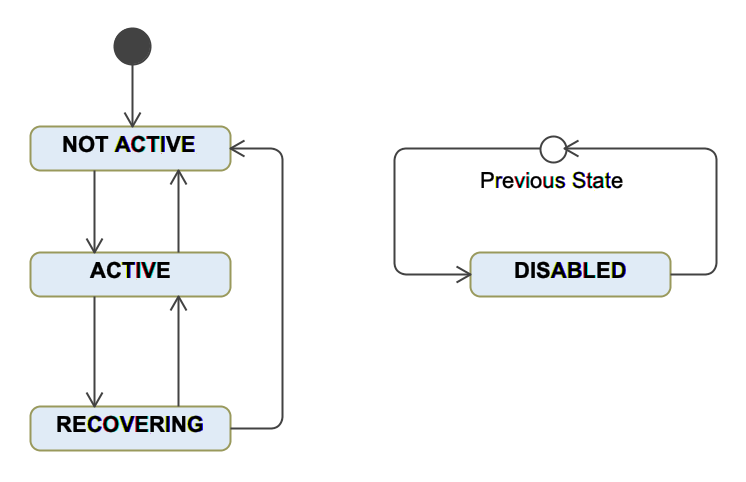
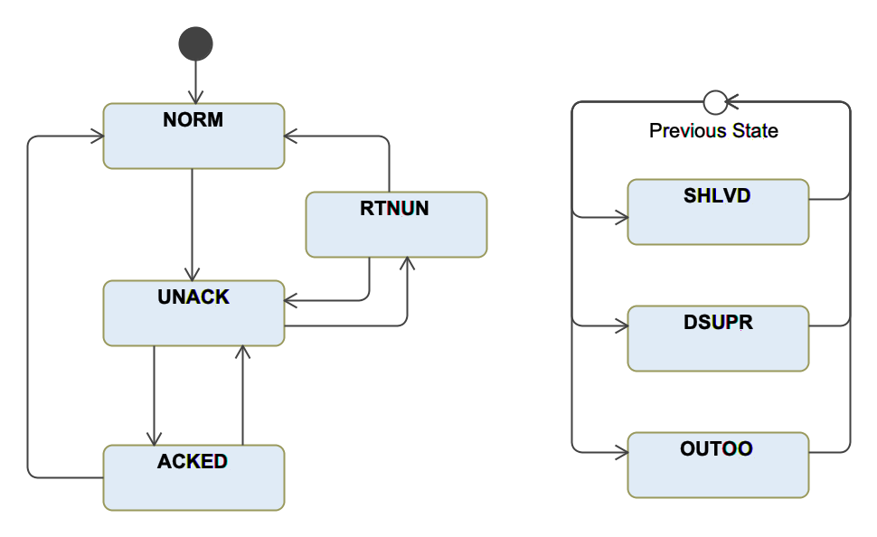
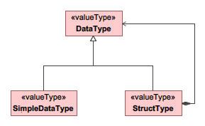

.. _modeling_guidelines:

Model specification guide document
==================================

Introduction
------------

The :ref:`OCS Architecture Document <SLPDR>` and the :ref:`Software and Controls Standards <dcs_reference_architecture>`
provide extended descriptions of the nature and scope of the Observatory
Control System. This document describes the use of a modeling language to write formal
specifications of OCS elements.

Modeling Language
-----------------

The OCS uses an internal Domain Specific Language (DSL) to create a
platform independent specification of the OCS Modules. The DSL uses
a Javascript transpiler (Coffeescript) that generates modern Javascript
(ES6) code that runs both in the browser and in nodeJS.
As a result of this the OCS Model can be used both by final applications
and by development tools. http://coffeescript.org provides an overview
of the Coffeescript syntax. The main characteristics of the DSL syntax:

   - Much more succint that Javascript, which facilitates the use of the language
     by non programers.

   - As an internal DSL it can benefit from the large number of nodeJS modules, which
     greatly facilitates the implementation of tools (e.g. code generation plugin).

   - Although is possible to write conformance rules in the model, the majority of
     the specifications are declarative.

   - The same DSL used to specify the model is used to specified the metamodel or
     the runtime configurations

   - The declaration of any model element always start with the identifier of the
     metaclass (e.g. Controller, Package). As those identifiers exists in the
     global context, there is no need to have awareness of module import declarations.

Model specification workflow
----------------------------

The next diagram shows an overview of the model specification workflow and it's
relation with formal testing. The :ref:`Software and Controls Standards <dcs_reference_architecture>`
provide a more detailed description of a module life-cycle and the role of formal
specifications in that context.

.. figure:: _static/dcs_implementation_strategy.png

   DCS Implementation Strategy

.. _classifier_def:

Model Classifier Features
-------------------------

Most Model Elements derive from the metaclass *Classifier*, which defines an
elemental modeling element. The metaclass *Classifier* is **abstract** and as such
it cannot be instantiated by itself. Model element specifications define a set of
features. Those features can be of three kinds:

==============     ===================================================================
Feature Kind       Description
==============     ===================================================================
attribute          The feature contains a value of the specified type
containment        The feature contains a collection of values of the specified type
reference          The feature contains a reference or set of references of the specified type
==============     ===================================================================

The features of a the *Classifier* metaclass are:

``name``
   The ``name`` feature is an attribute that defines the name of the *Classifier*.

``info``
   The ``info`` feature is an attribute that provides a short description of the *Classifier*.
   The *info* feature is used by plugings e.g. code or document generation, that need
   very basic information about the *Classifier*.

``desc``
   The ``desc`` feature is an attribute that provides an extended description of the *Classifier*.
   It's main use is in document generation, both in the on-line OCS user interface or
   in the generation of reports.

``tags``
   The ``tags`` feature is an containtment that defines the tags associated with the *Classifier*.
   Tags allow to perform tagged searches in the model. For example, this is used in the dynamic generation
   of collections in the user interface.

``extends``
   The ``extends`` feature makes reference to the model classes that are super classes of
   the *Classifier* being defined.  e.g. DCS, BasePositionController, EtherCAT adapter.

   Model inheritance doesn't extend all the features of a model element, only features whose
   kind is *containment* are extended. In the case of a *Component* those features are:

      - inputs
      - outputs
      - state_vars
      - properties
      - faults
      - alarms

``abstract``
   The ``abstract`` feature is a boolean attribute that defines if the *Classifier* can be
   instantiated. For example, this attribute is used in the code generator to prevent
   the application of instance transformations to abstract *Components*.

   .. note::

      All the transformations from PIM (Platform Independent Model) elements to PDM (Platform
      Dependent Model) elements, e.g. code generation, are considered instantation processes.
      For example a c++ class that implements a model Component is considered an instance
      of the model *Component* metaclass.

``notes``
   The ``notes`` feature is a containment that defines a set of notes associated with the *Classifier*.
   Notes can be used to attach unstructured information to a model element, e.g. for documentation purposes.
   A *Note* has the following features:

   ``name``
      The name of the *Note*

   ``desc``
      The text of the *Note*

``files``
   The ``files`` feature is an containment that defines a set of files associated with the *Classifier*.
   Files can be used to attach pre-existing information to the model element, e.g. vendor specifications.
   A *File* has the following features:

   ``name``
      The name of the *File*

   ``type``
      The type of the file, e.g. pdf, txt, html

   ``path``
      The path of the file relative to $GMT_LOCAL or $GMT_GLOBAL

   ``info``
      A short description of the file

Module Specification
--------------------

Introduction
............

*Subsystems* are the top level organization unit for software modules and hardware
components.  The *Components* that are part of a *Subsystem* are organized in *Packages*.
In order to fully specify a module a set of files is needed:

   - Module Definition File
   - Module Specification File
   - Module Loader File
   - Module Types File
   - Module Documentation File

The following sections describe each one of the files.

Module metaclass structure
..........................

The following diagram shows the metaclasses relevant to the definition of a *DCS* module:
A *DCS* is an aggregate of *Packages*, which are an aggregate of *Components*

.. figure:: _static/dcs_decomposition.png

   DCS Model Elements

Module File Mapping
...................

Each module is mapped into the file system using the following structure::

   <module>/
      |-- model
      |    |-- <module>.coffee
      |    |-- <module>_def.coffee
      |    |-- <module>.rst
      |    |-- <module>_ld.coffee
      |    |-- <module>_types.coffee
      |    |-- <pkg_1_pkg>/
      |    |        |-- <component_1>
      |    |        |-- ...
      |    |        |-- <component_n>
      |    |-- ...
      |    |-- <pkg_n_pkg>
      |    |-- webpack.config.coffee
      |-- src
      |    |-- coffee/
      |    |-- py/
      |    |-- cpp/
      |    |-- etc/
      |
      |-- docs/

Where ``<module>`` is the name of the module and ``<module>*.*`` are module files that
are described in the following sections.

Module Definition File
......................

The *Module* definition file specifies the structure, i.e. the *Packages* and *Component*
of the *Module*. The *Module* definition file must conform to the following naming convention:
<module_name>_def.coffee, e.g. *hdk_dcs_def.coffee*. For each *Component* it also specifies the *Component* features that
are relevant from the point of view of the *Module* management. Each *Component* can have
the following features:

``language``
   A set containing a list of the target languages for code generation, for example:

   .. code-block:: coffeescript

       {language: ['cpp', 'py'],...}

``build``
   Specifies how the generated code should be build. Possible values are:

   ``obj``
      When the language is compiled the generator will produce Makefile targets that
      build an object library with the Component code. The library file will be installed
      in $GMT_LOCAL/<deployment_destination>/lib/<platform>. Where platform is 'so' or 'js'.
      The value of <deployment_destination> depends on the attribute 'deploy'.

   ``app``
      When the language is compiled the generator will produce Makefile targets that
      build an executable. The executable file will be installed in $GMT_LOCAL/<deployment_destination>/bin.
      The value of <deployment_destination> depends on the attribute 'deploy'.

``deploy``
   Specifies where the artifacts resulting from building the generated code will be installed.
   The possible values are:

   ``dist``
      The build artifacts will be installed in the base module path: $GMT_LOCAL/

   ``test``
      The build artifacts will be installed in $GMT_LOCAL/test

   ``example``
      The build artifacts will be installed in $GMT_LOCAL/example

``codegen``
   If **true** the codegen transformations will be applied to the element, otherwise will be ignored.

``active``
   If **false** the element will be ignored by any gds command.

Module Specification File
.........................

The Module specification file contains the formal definition of the Module.
Modules are specified with the metaclass *Subsystem* unless a specialitation exists
like in the case of a *DCS*. In addition to the features of a *Classifier*
a *Subsystem* has the features of an *Aggregate* and a *PBE* (Product Breakdown Structure Element):

**Module Features**

``elements``
   The *Packages* owned by the *Subsystem* (from *Aggregate*)

``connectors``
   This attribute is a containment of :ref:`DataConnectors <data_connector_def>` which define the connection
   between *Components* of different *Module* packages.

``instances``
   Number of instances of the element.  (from *PBE*)

``pbs``
   The PBS number of the Module.  (from *PBE*)

``requirements``
   The ``requirements`` feature is a containment of *Requirements*.  (from *PBE*)

``types``
   The ``types`` attribute is a containment of references to the new types defined in the module. (from *Subsystem*)

``uses``
   The ``uses`` feature is a contaiment of references to the the modules the current *Module* depends on. (from *Subsystem*)

.. _data_connector_def:

**DataConnector Features**

In addition to the features of a :ref:`Classifier <classifier_def>` a *DataConnector* has the
following features:

``url``
   The address that the endpoints use to connect to the DataIO. The value of the url
   must conform to the following syntax: <transport>:<address>. The possible values
   of <transport> and <address> are:

   ============  ===========================  ==========================================================
   Transport     Address                      Description
   ============  ===========================  ==========================================================
   tcp           tcp://<host>:<port>          TCP transport. e.g. tcp://127.0.0.1:4040
   ipc           ipc:///<ipc endpoint>        Interprocess communication. e.g. ipc:///tmp/test_port.ipc
   inproc        inproc://<inproc endppoint>  Intraprocess communication. e.g. inproc://test_port
   ============  ===========================  ==========================================================

``blocking_mode``
   The ``blocking_mode`` is an attribute that defines the temporal behavior of the *DataIO*.
   The possible values are:

   ======  ================================================================
   Value   Description
   ======  ================================================================
   async   Data is processed by the *DataIO* as soon as it's available
   sync    Data is processed by the *DataIO* synchronously at the nominal rate of the *Connector*
   ======  ================================================================

``max_latency``
   The maximun latency in microseconds that is permisible once the connection is established.

``nom_rate``
   The nominal rate of the connection (with must be lower than the maximum rate of the connected ports).
   If the ``nom_rate`` is 0 it's behavior is considered episodic.

``units``
   This attribute is a reference to the *Component* port acting as source of the connector

``endpoints``
   This attribute is a containment of elements of metaclass *DataEndPoint*. *DataEndPoints* are the possible
   sources or destinations of the *DataConnector*.

.. note::

    In the current implementation only two conjugate endpoints are supported in all the SDK framework platforms.

.. _data_endpoint_def:

**DataEndPoint Features**

A *DataEndPoint* has the following features:

``name``
   This attribute is a reference to the *Component* port acting as source of the connector

``role``
   The communication pattern that the *DataIO* must implement. The possible
   values are:

   ==============  ============================================
   Protocol Value  Description
   ==============  ============================================
    PUSH           Emitter side in a data stream pipeline
    PULL           Receiver side in a data stream pipeline
    PUB            Publishes messages to a set of interested subscribers
    SUB            Receives messages from a registered publisher
    REQ            Emitter of a blocking request
    RPL            Replies to received requests
   ==============  ============================================

``element``
   This attribute is a reference to the instance of a *Component* port that is source or destination of the *DataConnector*

``path``
   ``path`` is an String attribute that defines which feature in the corresponding endpoint
   *Component* is source of destination of the *DataConnector* The feature is specified by defining its path in
   the following way: ``<feature_set>/<feature_name>/<feature_attribute>``, where:

       - ``feature_set``: the category of the component feature, eg.: state_vars, inputs
       - ``feature_name``: the name of the feature, e.g: op_state
       - ``feature_atrribute``: the name of the attribute of the feature e.g: value, goal, desc

See the next fragment of code for an example of Module specification

   .. code-block:: coffeescript

      DCS 'isample_dcs',
         info: 'Instrument Sample Device Control System'
         desc: require './isample_dcs.rst'

         types: [
            "isample_hmi_buttons"
            "isample_temp_measurements"
            "isample_motor_status"
            "isample_hmi_leds"
            "isample_motor_ctrl"
            "isample_sdo_data"
         ]

         uses:  [
            "ocs_core_fwk"
            "ocs_ctrl_fwk"
         ]

         connectors:

            cryo_external_temp:
                name:            'cryo_external_temp'
                blocking_mode:   'sync'
                url:             'sdp://'
                max_latency:     0.5
                nom_rate:        1
                owner:           'isample_hw1_adapter'
                endpoints:       [{ role: 'push', element: "isample_hw1_adapter",             path: "outputs/cryo_external_temp/value"}
                                  { role: 'pull', element: "isample_cryo_external_temp_ctrl", path: "inputs/temperatures/value"}]

            operator_buttons:
                name:            'operator_buttons'
                blocking_mode:   'sync'
                url:             'tcp://127.0.0.1:8422'  #as an example, here we use a TCP/IP dedicated port
                max_latency:     0.5
                nom_rate:        100
                owner:           'isample_hw1_adapter'
                endpoints:       [{ role: 'push', element: "isample_hw1_adapter", path: "outputs/operator_buttons/value"}
                                  { role: 'pull', element: "isample_focus1_ctrl", path: "inputs/hmi_inputs/value"}]

            ...

Module Loader File
...................

The Module Loader File contains the list of model files that will be loaded in the
GMT environment (e.g. by the gds command line application or by creating an
instance of *ModelContext*). The name of the module loader must conform to the
syntax *<module_name>_ld.coffee*.

By only including the model files that are completed in the module loader
file is possible to incrementaly update the model definition
files without loading those files that may be syntactically incorrect.

As is shown in the last line of the following example, the Module Loader File must
export the module definition file

   .. code-block:: coffeescript

      require './isample_dcs_types'
      require './isample_dcs'
      require './isample_ctrl_pkg/isample_ctrl_pkg'
      require './isample_ctrl_pkg/isample_ctrl_super'
      require './isample_ctrl_pkg/isample_temp_ctrl'
      require './isample_ctrl_pkg/isample_focus_ctrl'
      require './isample_ctrl_pkg/isample_filter_wheel_ctrl'
      require './isample_ctrl_pkg/isample_hw_adapter'
      require './isample_ctrl_pkg/isample_ctrl_fb'

      require './isample_cal_pkg/isample_cal_pkg'
      require './isample_cal_pkg/isample_cal_pipeline'

      require './isample_vis_pkg/isample_vis_pkg'
      require './isample_vis_pkg/isample_global_panel'

      module.exports = require './isample_dcs_def'   # export module definition file

Module Types File
.................

The Module Types File defines the *DataTypes* that are defined as part of the module.
The name of the Module Types File must conform to the syntax: *<module_name>_types.coffee*.
Check the section :ref:`data types <data_type_spec>` for a description of DataTypes.

Module Documentation File
.........................

In case that the description of the module is extensive, it is possible to
defined in an independent file instead of inline. The next example shows how to
include the documentation file in the Module Definition File.

   .. code-block:: coffeescript

       DCS 'isample_dcs',
          info: 'Instrument Sample Device Control System'
          desc: require './isample_dcs.rst'

Module Compilation
..................

Once the module is fully defined it has to be compiled running the command *webpack* in
the model directory of the module. The *webpack* command will process the model
files, optimize them and install the corresponding model library file
in $GMT_LOCAL/lib/js so they can be loaded by the OCS enviroment.
Everytime that a model file is modified it needs to be recompile
(e.g. if a Component definition is updated, the model library file has to be regenerated
so the code generation gds command can include the latest changes).

Package Specification
---------------------

Introduction
............

*Packages* are used to group software *Components* that show strong dependency between them. Software packages should be chosen
in a way that maximizes internal consistency and minimizes inter-package coupling.

Each DCS is made up of components organized into packages according to their
functional affinity or relationships. Examples of packages and their components
are shown in the Table below.

Types of Packages
.................

  Which packages exist in which subsystem depends on the specific functionality
  (e.g., some subsystems do not require special calibration components, or do
  not interface with hardware devices). The Table below describes this pattern,
  split in two categories:

    * Device Control Packages (DCP) – These packages are included in subsystems
      that involve the control of optomechanical hardware Devices.

    * Operation Support Packages (OSP) – These Packages include software
      components necessary to support health monitoring, automation, and proper
      operation of a Subsystem.  Diagnosis and calibration packages are
      emphasized early on in the design.  This is an area that is often
      overlooked despite the fact that they may take a significant amount of
      development effort, especially in the case of complex adaptive optics
      control subsystems.

.. table:: SWC Functional Packages:  Device Control

  +-----------------------+-----------------------------------------------------------+---------------------+
  |   Package Name        |   Description                                             |   Typical           |
  |                       |                                                           |   Components        |
  +=======================+===========================================================+=====================+
  |   Control Package     | Contains software Components that implement the           |   Supervisor,       |
  |                       | supervisory and control functions of a Device             |   Controller        |
  |                       | Control Subsystem (e.g., Mount Control System             |                     |
  |                       | Control Package).                                         |                     |
  +-----------------------+-----------------------------------------------------------+---------------------+
  |   Data Acquisition    | Contains software Components that implement the           |   Supervisor,       |
  |                       | supervisory and data acquisition functions of a Detector  |   Controller,       |
  |                       | Control Subsystem (e.g., AGWS Slope Processor Package).   |   Pipeline          |
  |                       | Only Subsystems that contain detectors (e.g wavefront     |                     |
  |                       | sensor, acquisition/guide camera or a science detector)   |                     |
  |                       | need to provide a Data Acquisition Package.               |                     |
  +-----------------------+-----------------------------------------------------------+---------------------+
  |   Hardware Package    | Contains hardware Components in which to deploy the       |   Device Control    |
  |                       | Device Control or Data Acquisition Package software       |   Computer,         |
  |                       | Component and the hardware to interface with the          |   I/O Module        |
  |                       | electro-mechanical Devices.                               |                     |
  +-----------------------+-----------------------------------------------------------+---------------------+

.. table:: SWC Functional Packages:  Operation Support

  +------------------+-------------------------------------------------------------+---------------------+
  |   Package Name   |   Description                                               |   Typical           |
  |                  |                                                             |   Components        |
  +==================+=============================================================+=====================+
  | Sequencing       |   Contains sequence Components necessary for the            |   Sequence          |
  | Package          |   operation of the Subsystem.                               |                     |
  +------------------+-------------------------------------------------------------+---------------------+
  | Diagnosis        |   Contains software Components necessary to implement       |   Supervisor,       |
  | Package          |   diagnosis functions when required.  This may involve      |   Controller,       |
  |                  |   the development of special control or operation modes.    |   Pipeline,         |
  |                  |                                                             |   Sequence          |
  +------------------+-------------------------------------------------------------+---------------------+
  | Calibration      |   Contains software Components necessary for the            |   Supervisor,       |
  | Package          |   calibration and characterization of hardware Devices.     |   Controller,       |
  |                  |   This may include the development of special control       |   Pipeline,         |
  |                  |   or operation modes.                                       |   Sequence          |
  |                  |   Calibration packages usually produce influence matrices,  |                     |
  |                  |   look up tables, or fitting polynomial coefficients.       |                     |
  |                  |   Often these components can be modeled as pipeline         |                     |
  |                  |   components and are run off-line.                          |                     |
  +------------------+-------------------------------------------------------------+---------------------+
  | Data             |   Contains software Components necessary for the            |   Supervisor,       |
  | Processing       |   calibration and processing of science and WFS detectors.  |   Pipeline          |
  | Package          |                                                             |                     |
  +------------------+-------------------------------------------------------------+---------------------+
  | Visualization    |   Contains software Components that provide custom          |   Panel,            |
  | Package          |   visualizations necessary for the efficient operation      |   Widget,           |
  |                  |   of a given Subsystem (e.g., M1 global status Panel).      |                     |
  |                  |   Note that default engineering Panels are available as     |                     |
  |                  |   part of the Engineering UI service.                       |                     |
  |                  |   Visualization components may encompass functions to       |                     |
  |                  |   enable the interaction of GMT users with the system:      |                     |
  |                  |   User experience, user interaction, data visualization     |                     |
  |                  |   and system navigation                                     |                     |
  +------------------+-------------------------------------------------------------+---------------------+
  | Observing        |   Observing Tool (OT) components provide instrument         |   Panel,            |
  | Tool             |   specific editors that integrate with the GMT              |   Widget,           |
  | Plugin           |   Observing Tools to facilitate the specification of        |   Pipeline          |
  | Package          |   instrument specific observation parameters.               |                     |
  +------------------+-------------------------------------------------------------+---------------------+
  | Safety           |   Contains software/hardware Components that implement      |   Supervisor,       |
  | Package          |   Subsystem specific safety functions.  These Components    |   Controller        |
  |                  |   often interface with the ISS, but are independent         |                     |
  |                  |   (e.g., M1 safety controller).                             |                     |
  +------------------+-------------------------------------------------------------+---------------------+
  | Operation        |   Contains Components that allow the automation of high-    |   Workflow          |
  | Workflows        |   level operation workflows relative to the Subsystem       |                     |
  | Package          |   (e.g., unit test workflow, or calibration workflow in     |                     |
  |                  |   case that several sequences and human operations are      |                     |
  |                  |   involved).                                                |                     |
  +------------------+-------------------------------------------------------------+---------------------+
  | Management       |   Contains Components that capture the development          |   Plan,             |
  | Package          |   backlog and the Assembly Integration and Testing plans.   |   Workflow          |
  +------------------+-------------------------------------------------------------+---------------------+

Package Specification File
..........................

The *Package* specification file contains the formal definition of the *Package*. Packages
are specified with the metaclass *Package*. In addtion to the features of a *Classifier*
a *Package has the features of an *Aggregate* and a *PBE*. We will omit the definition
of the *Package* *PBE* and *Aggregate* features as they are the same as the *Subsystem*.

``connectors``
   List of :ref:`DataConnector <data_connector_def>` between *Components* belonging to the package.

Component Specification
-----------------------

Introduction
............

The design of the GMT software and controls system is based on a distributed
component architecture. Components represent the most elementary unit for the
purpose of development, testing, integration and reuse. Groups of components can
be connected to create composite modules that implement complex functions.
Component interfaces are defined using Ports, which can be linked by means of
Connectors. For example, connectors are used to (a) integrate standardized
reusable control components with a given field bus configuration; (b) connect
component responses with user interface components; or (c) connect components
with common observatory services. Connectors are specified in the model without
making any assumption of the underlying middleware used by the platform-specific
implementation.

Components, Ports and Connectors are used to model both physical and logical
systems. SysML internal block diagrams (*ibd*) are used to represent how
components relate to each other.

The basic components used to model the device control domain are Device
Controllers and Supervisors. Device controllers are specialized components that
implement the control function of single degree of freedom (e.g. linear position
controller) or multiple degrees of freedom that coordinate more elementary ones
(e.g. axis group controller). Supervisors implement the high-level interfaces of
DCSs and are responsible of the subsystem integrity (e.g. collision avoidance),
component configuration, subsystem robustness, component life cycle and
subsystem modal transitions amongst other functions.

Component Specification File
............................

Each Component is specified in it's own independent file.
In order to define a Component first we need to establish the
component metaclass. The OCS metamodel defines a set of Component subtypes:
(e.g. Controller, Pipeline, Adapter). After chosing the Componet metaclass  class in case is an
specialitation of a class of Components

.. _component:

Component Features
..................

The following diagrams shows the basic structure of a *Component* and it's building blocks.

  Component model metaclasses

The *Component* metaclass extends *SCI* (Software Configuration Item), which also extends
*Classifier* and *PBE*. Therefore, in addition to the features of a *Classifier* and
a *PBE*, a *Component* has the following features:

      - inputs
      - outputs
      - state_vars
      - properties
      - faults
      - alarms

.. _value_classifier_def:

*ValueClassifier* Features
..........................

Each one of the *Component* features is a *ValueClassifier*. A *ValueClassifier* is a *Classifier* to which a value can be assigned. A *ValueClassifier* declaration
has the following features.

``type``
   The type of the data that can be assign to the *ValueClassifier*. Appendix A
   shows the predefined types in the model. Each of the types has a mapping to
   each of the existing language implementations.

``units``
   The units that must be used to interpret the value of the *ValueClassifier*. Appendix
   B shows the predefined units in the model.

``min``
   The minimum value that can be assigned to the *ValueClassifier*

``max``
   The maximum value that can be assigned to the *ValueClassifier*

``default``
   The maximum value that can be assigned to the *ValueClassifier*

``value``
   The actual value assigned to the *ValueClassifier*

*Component* *ValueClassifiers* can be of two types, *DataIO* an *Properties*

.. _dataio_def:

*DataIO* Features
...................

``max_rate``
   The maximum update rate in Hz that the port must support

.. _storage_def:

``storage``
   The ``storage`` feature is an integer attribute that defines the decimation factor

   ======  ===================================
   Value   Description
   ======  ===================================
   0       No data is stored
   1       All data is stored
   > 1     The data is decimated by the factor
   ======  ===================================

``sampling_rate``
   This feature is an attribute that defines the rate at which the *StateVariable* must be sampled.

``sampling_deadband``
   This feature is an attribute that defines the sampling deadband of the *StateVariable*

*Property* Features
...................

.. _properties:

The ``properties`` feature is a containment of *Property* that defines the data of
a *Component* that can be changed for each *Component* intance or that can be changed
at runtime. A *Property* extends the metaclass *ValueClassifier*. In addition of the
features of a *ValueClassifier* a *Property* has the following features:

``storage``
    See :ref:`storage <storage_def>` definition in the *DataIO* description

*Input* and *Outputs* Features
..............................

.. _inputs:

``inputs``
   The ``inputs`` feature is a containment of *DataIO* that defines the data that must be
   accepted by the *Component*. Each element of the ``inputs`` containment has the features
   of a *DataIO*.

.. _outputs:

``outputs``
   The ``outputs`` feature is a containment of *DataIO* that defines the data that can be
   produced by the *Component*. Each element of the ``outputs`` containment has the features
   of a *DataIO*.

*StateVariable* Features
........................

.. _state_vars:

The ``state_vars`` feature is a containment of *StateVariable*.
A state variable is one of the set of variables that are used to describe
the mathematical 'state' of a dynamical system. In the architecture of the OCS, State Variables provide
the basic concept to integrate State Analysis with Sequence Based Specification techniques.
As *StateVariable* extends *DataIO*, in addition to the :ref:`features of DataIO <dataio_def>`
an *StateVariable* has the following features:

``goal``
    This feature is an attribute which contains the value that the *StateVariable* must achieve.

``control_rate``
    This feature is an attribute that defines the rate at which the controller that is responsible to
    maintain the *StateVariable* has to update it's control law.

``is_controllable``
    This feature is a boolean attribute that defines if the *StateVariable* can be controlled. This used
    to model physical phenomena that are part of the definition of the state of the system, but that not
    be affected by the control action (e.g. wind speed). Non Controllable *StateVariable* are used
    to implement behavior that is dependent on their state by setting goals monitors on their value
    (e.g. close observing shutter if wind is higher than 25 m/s)

``control_deadband``
    This feature is an attribute that defines the control deadband of the *StateVariable*

*Faults* Features
.................

.. _faults:

The ``faults`` feature is a containment of *Fault*. The main purpuse of a *Fault* is to
detect and if possible handle non-nominal operating conditions. Faults are organized
in a simplified Fault Tree similar to the ones used Fault Tree Analysis (FTA).
In addition to the features of *StateVariable*, *Fault* has the following features:

``kind``
    The ``kind`` feature is a *String* attribute with the following possible values:

    ==============  =========================================================================
    Node Kind       Description
    ==============  =========================================================================
    primary         Primary faults detect the occurence of a fault condition
    secondary       Represent a transfer from another fault tree
    or              OR gate. The fault occurs if any of the children faults occurs
    and             AND gate. The fault occurs if all of the children faults occur
    xor             The fault occurs if only one of the children faults occurs
    count           The fault occurs if at least *count* number of the children faults occurs
    ==============  =========================================================================

``parent``
    The ``parent`` feature is an attribute that contains the name of the parent
    fault in the fault tree. If the fault is the root of the fault tree the value
    shall be the empty string. Root nodes can be used to connect with other fault trees
    secondary (transfer in) nodes.

``level``
    The ``level`` of severity of the *fault*. Severity levels are TBD

``rate``
    The ``rate`` feature is an attribute that defines the frecuency at which the
    fault condition is evaluated.

``threshold``
    The ``threshold`` feature is an attribute that defines the number of cycles
    in which the fault condition occurs before the *fault* becomes active.

``count``
    The ``count`` feature is an attribute that defines the number of children
    fault when the *fault* is of ``kind`` ``count``.

The possible values of a *fault* are defined with the FaultFSM state machine as shown
in the followint figure:

Fault state machine diagram

The possible states of the Fault state machine are:

``ACTIVE``
    The *fault* is in ``ACTIVE`` state when the fault condition is true.

``NOT_ACTIVE``
    The *fault* is in ``NOT_ACTIVE`` state when the fault condition is false.

``RECOVERING``
    The *fault* is in ``RECOVERING`` state when a recovery action is defined for the fault
    and the *Component* is executing such action. The outcome of the recovery action can be that
    either the fault is addressed an the new *fault* state is ``NOT_ACTIVE`` or the fault recovery
    action fails and the new *fault* state is ``ACTIVE``.

``DISABLED``
    The *fault* is in ``DISABLED`` state when a goal of the *fault* state variable is set to ``DISABLED``
    in ``DISABLED`` state the *fault* condition is not evaluated.

.. note::

    The details of how to define a fault evaluation function to test for the occurrence of a fault
    condition or how to define a recovery action are part of the implementation. The mapping to the
    different platforms provides a description for each case.

*Alarm* Features
.................

.. _alarms:

The ``alarms`` feature is a containment of *Alarm*. Alarms can be grouped and
organized in a similar way to Fault Trees. The purpose of an *Alarm* is the identification
and notification of operating conditions that require operator attention.
In addition to the features of *StateVariable*, *Alarm* has the following features:

``level``
    The ``level`` feature is an attribute that defines the severity of the alarm.
    Severity levels are TBD

``rate``
    The ``rate`` feature is an attribute that defines the frecuency at which the
    alarm condition is evaluated.

``threshold``
    The ``threshold`` feature is an attribute that defines the number of cycles
    in which the alarm condition occurs before the alarm becomes active.

``kind``
    The ``kind`` feature is a *String* attribute with the following possible values:

    ==============  =========================================================================
    Node Kind       Description
    ==============  =========================================================================
    primary         Must evaluate to
    secondary       Represent a transfer from another alarm tree
    or              OR gate. The alarm occurs if any of the children alarm occurs
    and             AND gate. The alarm occurs if all of the children alarm occur
    xor             The alarm occurs if only one of the children alarm occurs
    count           The alarm occurs if at least *count* number of the children alarm occurs
    ==============  =========================================================================

``shelving_timeout``
    The ``shelving_timeout`` feature is a *Integer* attribute. If the *alarm* is disabled by the operator
    the shelving will finish after the duration of the ``shelving_timeout`` is elapsed. The units are nanoseconds

``auto_ack``
    The ``auto_ack`` feature is a *Boolan* attribute. When *true* the alarm will be acknowledged automatically.

The possible values of an *alarm* are defined with the FaultFSM state machine as shown
in the following figure:

    Alarm state machine diagram

The possible values of an *alarm* are:

``NORM``
    The *alarm* is in ``NORM`` state when the alarm condition is not true.

``UNACK``
    The *alarm* is in ``UNACK`` state when the alarm condition is false.

``ACKED``
    The *alarm* is in ``ACKED`` state when it has been acknowledged by the operator.

``RTNUN``
    The *alarm* is in ``RTNUN`` state when the alarm condition stops been active before
    is acknowledged by the operator.

``SHLVD``
    The *alarm* is in ``SHLVD`` state when a goal of the *alarm* state variable is set to ``SHLVD``
    by the operator.

``DSUPR``
    The *alarm* is in ``DSUPR`` state when a goal of the *alarm* state variable is set to ``DSUPR``
    by the operator.

``OUTOO``
    The *alarm* is in ``OUTOO`` state when a goal of the *alarm* state variable is set to ``OUTOO``
    by the operator.

*Port* Features
...............

.. _ports:

The ``ports`` feature is a containment of *Ports*.

``buffered``
    The ``buffered`` feature is an integer attribute that defines the size of the buffer in case
    the *DataIO* stream must be buffered. When size is 0 the data will not be buffered.

``retrys``
    The maximum number of retries in case of communication problems

.. _data_type_spec:

DataType specification
.......................

It is possible to define simple and complex hetereogeneous types by using the *DataType*, *StructType* and *Enum* metaclases.

    DataType structure

``ValueType``
    A ValueType is used to express a value of a DataType attribute. For example when defining the default value of a feature
    of the type *DataType*
    The syntax used is an expression in the host language of the model DSL (i.e. coffeescript):
    The expression can be one of the following:
    - A number to express the value of a scalar attribute
    - An string
    - An array e.g. [1,2,4] to express the value of an array, where each element of the array can be other *ValueType*
    - An Object literal e.g. {one: 1, two: "dos"} to express the value of a *StructType*. The value of the attribute
      of each objet literal can be other *ValueType*

``DataType``
    The metaclass ``DataType`` allows the definition of the types that can be used in the specification of
    other model elements. For example, the *type* feature of a *Property* is *DataType*

    ``size``
        The ``size`` feature is an attribute that defines the size of the *DataType* in bytes.

    ``default``
        The ``default`` feature is an attribute that defines the default value of the *DataType* when initialized.

``StructType``
    The metaclass ``StructType`` is a specialization of *DataType* that contain other *DataType*. ``StructType`` have the
    following features:

    ``elements``
        The ``elements`` feature is a containment of *DataType*. Each element can be of different type
        including other *DataType* or *StructType*. This allow the creation of complex types.

``Enum``
    The metaclass ``Enum`` is a *DataType* that contain a list of literals. The ``Enum`` metaclass has the following features:

    ``literals``
        The ``literals`` feature is a containment of *Literals*. Each *Literal* is defined by a name and a description.

The following section shows an excerpt of a Module Types File

   .. code-block:: coffeescript

      DataType "uint16",
        size:    2
        default: 0
        desc:    "Two bytes unsigned integer   (0 to 65535)"

      StructType "isample_hmi_buttons",
         desc: "digital inputs corresponding to pressed buttons"
         elements:   # Change name
            red_push_button:   { desc: "RED Push Button",       type: "bool",     units: "" }
            green_push_button: { desc: "GREEN Push Button",     type: "bool",     units: "" }
            emergency_button:  { desc: "Emergency Button",      type: "bool",     units: "" }

      StructType "isample_temp_measurements",
         desc: "temperature measurements",
         elements:
            temp_sensor1:      { desc: "temperature sensor #1", type: "uint16_t", units: "celsius" }
            temp_sensor2:      { desc: "temperature sensor #2", type: "uint16_t", units: "celsius" }
            press_sensor1:     { desc: "pressure sensor    #1", type: "uint16_t", units: "bar" }

      StructType "isample_motor_status",
         desc: "status of motor device"
         elements:
            ready:             { desc: "Axis Ready",            type: "bool",     units: "" }
            enabled:           { desc: "Axis Enabled",          type: "bool",     units: "" }
            warning:           { desc: "Axis Warning",          type: "bool",     units: "" }
            error:             { desc: "Axis Error",            type: "bool",     units: "" }
            moving_positive:   { desc: "Axis Moving +",         type: "bool",     units: "" }
            moving_negative:   { desc: "Axis Moving -",         type: "bool",     units: "" }

Behaviors specification
.......................

In order to specify the behavior of a model element the model provides the metaclasses *Behavior* and *StateMachine*

``Behavior``
    The ``Behavior`` metaclass is a ``Classifier`` that captures the behavioral characteristics of a model element. The detailed specification
    is implementation dependant and the modeling DCS doesn't include an action language that would allow a formal
    specification, instead a textual description is required. In addition to the *desc* feature of a ``Classifier`` is
    possible to use other ``Classifier`` features like *files* or *notes* to attach diagrams that complement the
    informal description of the ``Behavior``

.. _state_machine:

``StateMachine``
    The ``StateMachine`` metaclass is a ``Behavior`` that represents a Meally or Moore state machine.
    In addition to the features of a ``Classifier`` and a ``Behavior``, the ``StateMachine`` metaclass
    has the following features:

    ``states``
        The ``states`` feature is an containment attribute that defines the possible states of the ``StateMachine``

``State``
    The ``State`` metaclass represents an state of a Meally or Moore state machine.
    In addition to the features of a ``Classifier``, the ``State`` metaclass has the following features:

    ``is_initial``
        The ``is_initial`` feature is a Boolean attribute that indicates that the current state is the initial state.

    ``pre``
        The ``pre`` feature is an array of strings that identifies from which state the current state can be reached. If
        the current state can be reached from any other state the value can be '*', e.g. pre: ['*']

Appendix A - Model DataType Listing
-----------------------------------

The following paragraph includes the formal definition of the *DataType* classes predefined in the model.

   .. code-block:: coffeescript

      DataType "bool",         {size: 1,  default: false, desc: "Boolean value"}
      DataType "bit",          {size: 1,  default: 0,     desc: "Bit value"}
      DataType "byte",         {size: 1,  default: 0,     desc: "Byte value"}

      DataType "int",          {size: 1,  default: 0,     desc: "Platform integer (normally either int32 or in64" }
      DataType "int8",         {size: 1,  default: 0,     desc: "One byte signed integer.   (-128                 to 127)"}
      DataType "int16",        {size: 2,  default: 0,     desc: "Two bytes signed integer   (-32768               to 32767)"}
      DataType "int32",        {size: 4,  default: 0,     desc: "Four bytes signed integer  (-2147483648          to 2147483647)"}
      DataType "int64",        {size: 4,  default: 0,     desc: "Eigth bytes signed integer (-9223372036854775808 to 9223372036854775807 )" }

      DataType "uint",         {size: 4,  default: 0,     desc: "Four bytes unsigned integer  (0 to 4294967295)"}
      DataType "uint8",        {size: 1,  default: 0,     desc: "One byte unsigned integer.   (0 to 255)"}
      DataType "uint16",       {size: 2,  default: 0,     desc: "Two bytes unsigned integer   (0 to 65535)"}
      DataType "uint32",       {size: 4,  default: 0,     desc: "Four bytes unsigned integer  (0 to 4294967295)"}
      DataType "uint64",       {size: 4,  default: 0,     desc: "Eigth bytes unsigned integer (0 to 18446744073709551615"}

      DataType "float",        {size: 8,  default: 0.0,   desc: "Shorthand for float64 (numpy)"}
      DataType "float16",      {size: 4,  default: 0.0,   desc: "Half precision float: sign bit, 5 bits exponent, 10 bits mantissa"}
      DataType "float32",      {size: 6,  default: 0.0,   desc: "Sigle precision float: sign bit, 8 bits exponent, 23 bits mantissa"}
      DataType "float64",      {size: 8,  default: 0.0,   desc: "Double precision float: sign bit, 11 bits exponent, 52 bits mantissa"}

      DataType "complex",      {size: 8,  default: 0.0,   desc: "Shorthand for complex128 (numpy)"}
      DataType "complex64",    {size: 4,  default: 0.0,   desc: "Complex number, two 32-bit floats"}
      DataType "complex128",   {size: 8,  default: 0.0,   desc: "Complex number, two 64-bit floats"}

      DataType "string",         {size: 0,  default: "",  desc: "UTF-8 string type (unlimited length"}
      DataType "TimeValue_ns",   {size: 0,  default: "",  desc: "Time value in nanoseconds"}
      DataType "TimeValue_us",   {size: 0,  default: "",  desc: "Time value in microseconds"}
      DataType "TimeValue_Date", {size: 0,  default: "",  desc: "Time value as an ISO date"}
      DataType "struct",         {size: 0,  default: "",  desc: "Structured type"}
      DataType "enum",           {size: 0,  default: "",  desc: "enum type"}

Appendix B - Model UnitType Listing
-----------------------------------

The following paragraph includes the formal definition of the *UnitType* classes predefined in the model.

   .. code-block:: coffeescript

      UnitType "meter",       {quantity: "length",                    symbol: "m",             desc: "SI base unit: metre"}
      UnitType "kilogram",    {quantity: "mass",                      symbol: "kg",            desc: "SI base unit: kilogram"}
      UnitType "second",      {quantity: "time",                      symbol: "s",             desc: "SI base unit: second"}
      UnitType "ampere",      {quantity: "electric current"         , symbol: "A",             desc: "SI base unit: ampere"}
      UnitType "kelvin",      {quantity: "thermodynamic temperature", symbol: "K",             desc: "SI base unit: kelvin"}
      UnitType "mole",        {quantity: "amount of substance",       symbol: "mol",           desc: "SI base unit: mole"}
      UnitType "candela",     {quantity: "luminous intensity",        symbol: "cd",            desc: "SI base unit: candela"}
      UnitType "radian",      {quantity: "plane angle",               symbol: "rad",           desc: "SI base unit: radian"}
      UnitType "steradian",   {quantity: "solid angle",               symbol: "sr",            desc: "SI base unit: steradian"}
      UnitType "hertz",       {quantity: "frecuency",                 symbol: "HZ",            expression: "s^-1",                    desc: "SI derived unit:hertz"}
      UnitType "newton",      {quantity: "force",                     symbol: "N",             expression: "Kg m s^-2",               desc: "SI derived unit:newton"}
      UnitType "pascal",      {quantity: "pressure",                  symbol: "Pa",            expression: "N m^-2",                  desc: "SI derived unit: pascal"}
      UnitType "joule",       {quantity: "energy",                    symbol: "J",             expression: "N m",                     desc: "SI derived unit:joule"}
      UnitType "watt",        {quantity: "power",                     symbol: "W",             expression: "J s^-1",                  desc: "SI derived unit:watt"}
      UnitType "milliampere", {quantity: "electric current",          symbol: "mA",            expression: "A",                       desc: "SI derived unit:milliampere"}
      UnitType "coulomb",     {quantity: "electric charge",           symbol: "C",             expression: "A s",                     desc: "SI derived unit:coulomb"}
      UnitType "volt",        {quantity: "electric potential",        symbol: "V",             expression: "",                  desc: "SI derived unit:volt"}
      UnitType "ohm",         {quantity: "electric resistance",       symbol: "Omega",         expression: "",                  desc: "SI derived unit:ohm"}
      UnitType "siemens",     {quantity: "electric conductance",      symbol: "Siemens",       expression: "",                  desc: "SI derived unit:siemenstz"}
      UnitType "farad",       {quantity: "electric capacitance",      symbol: "F",             expression: "",                  desc: "SI derived unit:farad"}
      UnitType "weber",       {quantity: "magnetic flux",             symbol: "WbV",           expression: "",                  desc: "SI derived unit:weber"}
      UnitType "tesla",       {quantity: "magnetic flux density",     symbol: "T",             expression: "",                  desc: "SI derived unit:tesla"}
      UnitType "henry",       {quantity: "inductance",                symbol: "H",             expression: "",                  desc: "SI derived unit:henry"}
      UnitType "lumen",       {quantity: "luminous flux",             symbol: "lm",            expression: "",                  desc: "SI derived unit:lument"}
      UnitType "lux",         {quantity: "iluminance",                symbol: "lx",            expression: "",                  desc: "SI derived unit:lux"}
      UnitType "minute",      {quantity: "time",                      symbol: "mm",            expression: "60 s",                    desc: "Non-SI unit:minute"}
      UnitType "hour",        {quantity: "time",                      symbol: "hh",            expression: "3600 s = 60 min",         desc: "Non-SI unit:hour"}
      UnitType "day",         {quantity: "time",                      symbol: "dd",            expression: "86400 s = 24 h",          desc: "Non-SI unit:day"}
      UnitType "year",        {quantity: "time",                      symbol: "a",             expression: "31.5576 Ms = 365.25 d s", desc: "Non-SI unit:year"}
      UnitType "degree",      {quantity: "plane angle",               symbol: "o",             expression: "(pi/180) rad",            desc: "Non-SI unit:degree"}
      UnitType "arcminute",   {quantity: "plane angle",               symbol: "arcmin",        expression: "(pi/10800) rad",          desc: "Non-SI unit:arcminute"}
      UnitType "arcsecond",   {quantity: "plane angle",               symbol: "arcsec",        expression: "(pi/648000) rad",         desc: "Non-SI unit:arcsecond"}
      UnitType "milliarcsecond",    {quantity: "plane angle",         symbol: "mas",           expression: "(pi/648000000) rad",      desc: "Non-SI unit:milliarcsecond"}
      UnitType "revolution",        {quantity: "plane angle",         symbol: "c",             expression: "2pi rad",                 desc: "Non-SI unit:revolution"}
      UnitType "astronomical unit", {quantity: "length",              symbol: "au",            expression: "0.149598 Tm",             desc: "Non-SI unit:astronomical unit"}
      UnitType "light year",  {quantity: "length",                    symbol: "lyr",           expression: "9.460730 10^15",          desc: "Non-SI unit:light year"}
      UnitType "parsec",      {quantity: "length",                    symbol: "pc",            expression: "30.857 Pm",               desc: "Non-SI unit:parsec"}
      UnitType "count",       {quantity: "event",                     symbol: ["count", "ct"],  expression: "",                       desc: "Non-SI unit:count"}
      UnitType "photon",      {quantity: "event",                     symbol: ["photon", "ph"], expression: "",                       desc: "Non-SI unit:photon"}
      UnitType "magnitude",   {quantity: "flux density",              symbol: "mag",           expression: "",                        desc: "Non-SI unit:magnitude"}
      UnitType "pixel",       {quantity: "(image/detector) pixel",    symbol: "pix",           expression: "",                        desc: "Non-SI unit:pixel"}
      UnitType "inch",        {quantity: "length",                    symbol: "in",            expression: "",                        desc: "Non-SI unit:pixel"}
      UnitType "micron",      {quantity: "length",                    symbol: "mum",           expression: "",                        desc: "Non-SI unit:pixel"}
      UnitType "fermi",       {quantity: "length",                    symbol: "fm",            expression: "",                        desc: "Non-SI unit:pixel"}
      UnitType "angstrom",    {quantity: "length",                    symbol: "ang",           expression: "",                        desc: "Non-SI unit:pixel"}
      UnitType "kilometer",   {quantity: "length",                    symbol: "km",            expression: "",                        desc: "Non-SI unit:pixel"}
      UnitType "millimeter",  {quantity: "length",                    symbol: "mm",            expression: "",                        desc: "Non-SI unit:pixel"}
      UnitType "centimeter",  {quantity: "length",                    symbol: "cm",            expression: "",                        desc: "Non-SI unit:pixel"}
      UnitType "megaparsec",  {quantity: "length",                    symbol: "Mpc",           expression: "",                        desc: "Non-SI unit:pixel"}
      UnitType "solarradius", {quantity: "length",                    symbol: "Rsol",          expression: "",                        desc: "Non-SI unit:pixel"}
      UnitType "gram",        {quantity: "mass",                      symbol: "g",             expression: "",                        desc: "Non-SI unit:pixel"}
      UnitType "solarmass",   {quantity: "mass",                      symbol: "Msol",          expression: "",                        desc: "Non-SI unit:pixel"}
      UnitType "uam",         {quantity: "mass",                      symbol: "",              expression: "",                        desc: "Non-SI unit:pixel"}
      UnitType "sdsecond",    {quantity: "time",                      symbol: "ss",            expression: "",                        desc: "Non-SI unit:pixel"}
      UnitType "millisecond", {quantity: "time",                      symbol: "ms",            expression: "",                        desc: "Non-SI unit:pixel"}
      UnitType "microsecond", {quantity: "time",                      symbol: "mus",           expression: "",                        desc: "Non-SI unit:pixel"}
      UnitType "nanosecond",  {quantity: "time",                      symbol: "ns",            expression: "",                        desc: "Non-SI unit:pixel"}
      UnitType "month",       {quantity: "time",                      symbol: "month",         expression: "",                        desc: "Non-SI unit:pixel"}
      UnitType "week",        {quantity: "time",                      symbol: "week",          expression: "",                        desc: "Non-SI unit:pixel"}
      UnitType "century",     {quantity: "time",                      symbol: "century",       expression: "",                        desc: "Non-SI unit:pixel"}
      UnitType "archour",     {quantity: "plane angle",               symbol: "hr",            expression: "",                        desc: "Non-SI unit:pixel"}
      UnitType "celsius",     {quantity: "thermodynamic temperature", symbol: "C",             expression: "",                        desc: "Non-SI unit:pixel"}
      UnitType "farenheit",   {quantity: "thermodynamic temperature", symbol: "F",             expression: "",                        desc: "Non-SI unit:pixel"}
      UnitType "bit_unit",    {quantity: "information",               symbol: "b",             expression: "",                        desc: "Non-SI unit:pixel"}
      UnitType "byte",        {quantity: "information",               symbol: "B",             expression: "",                        desc: "Non-SI unit:pixel"}
      UnitType "kilobyte",    {quantity: "information",               symbol: "KB",            expression: "",                        desc: "Non-SI unit:pixel"}
      UnitType "megabyte",    {quantity: "information",               symbol: "MB",            expression: "",                        desc: "Non-SI unit:pixel"}
      UnitType "gigabyte",    {quantity: "information",               symbol: "GB",            expression: "",                        desc: "Non-SI unit:pixel"}
      UnitType "terabyte",    {quantity: "information",               symbol: "TB",            expression: "",                        desc: "Non-SI unit:pixel"}
      UnitType "kilohertz",   {quantity: "frecuency",                 symbol: "KHz",           expression: "",                        desc: "Non-SI unit:pixel"}
      UnitType "megahertz",   {quantity: "frecuency",                 symbol: "MHz",           expression: "",                        desc: "Non-SI unit:pixel"}
      UnitType "gigahertz",   {quantity: "frecuency",                 symbol: "GHz",           expression: "",                        desc: "Non-SI unit:pixel"}
      UnitType "terahertz",   {quantity: "frecuency",                 symbol: "THz",           expression: "",                        desc: "Non-SI unit:pixel"}
      UnitType "liter",       {quantity: "volume",                    symbol: "l",             expression: "",                        desc: "Non-SI unit:liter"}

      Multiple "deci",  {symbol: "d",  factor: 1e-1,  desc: "SI Submultiple prefix"}
      Multiple "centi", {symbol: "c",  factor: 1e-2,  desc: "SI Submultiple prefix"}
      Multiple "milli", {symbol: "m",  factor: 1e-3,  desc: "SI Submultiple prefix"}
      Multiple "micro", {symbol: "mu", factor: 1e-6,  desc: "SI Submultiple prefix"}
      Multiple "nano",  {symbol: "n",  factor: 1e-9,  desc: "SI Submultiple prefix"}
      Multiple "pico",  {symbol: "p",  factor: 1e-12, desc: "SI Submultiple prefix"}
      Multiple "femto", {symbol: "f",  factor: 1e-15, desc: "SI Submultiple prefix"}
      Multiple "atto",  {symbol: "a",  factor: 1e-18, desc: "SI Submultiple prefix"}
      Multiple "deca",  {symbol: "da", factor: 1e+1,  desc: "SI Multiple prefix"}
      Multiple "hecto", {symbol: "h",  factor: 1e+2,  desc: "SI Multiple prefix"}
      Multiple "kilo",  {symbol: "k",  factor: 1e+3,  desc: "SI Multiple prefix"}
      Multiple "mega",  {symbol: "M",  factor: 1e+6,  desc: "SI Multiple prefix"}
      Multiple "giga",  {symbol: "G",  factor: 1e+9,  desc: "SI Multiple prefix"}
      Multiple "tera",  {symbol: "T",  factor: 1e+12, desc: "SI Multiple prefix"}
      Multiple "peta",  {symbol: "P",  factor: 1e+15, desc: "SI Multiple prefix"}
      Multiple "exa",   {symbol: "E",  factor: 1e+18, desc: "SI Multiple prefix"}

      MathematicalConstant "pi", {value: 3.1415926536, desc: ""}

      PhysicalConstant "c", {value: 2.99792458e8,    units: "ms^-1",           desc: "" }
      PhysicalConstant "G", {value: 3.1415926536e16, units: "m^3 kg^-1 s-2",   desc: "" }
