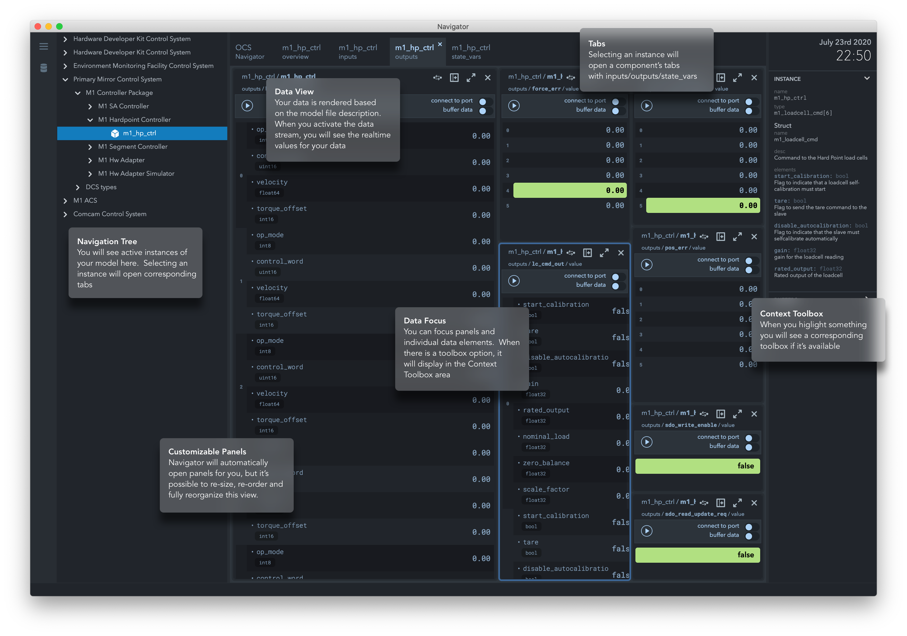
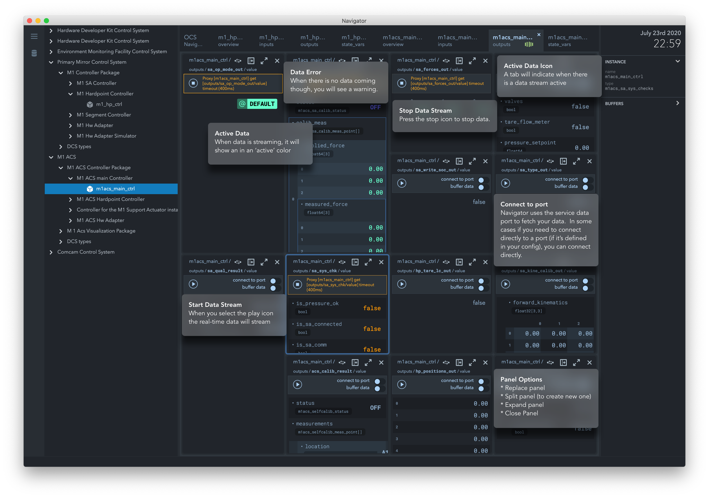
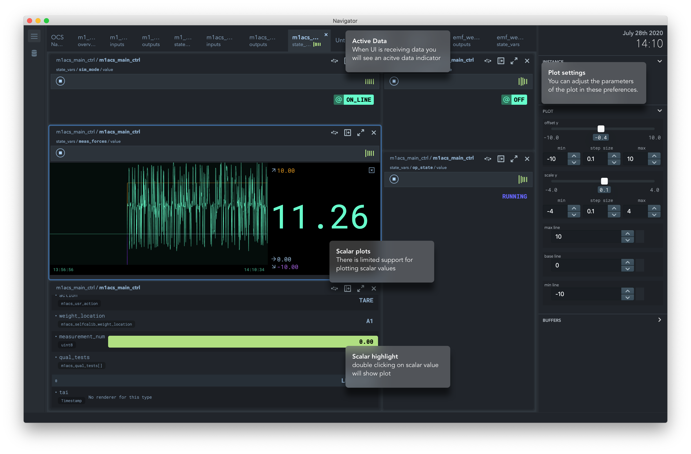
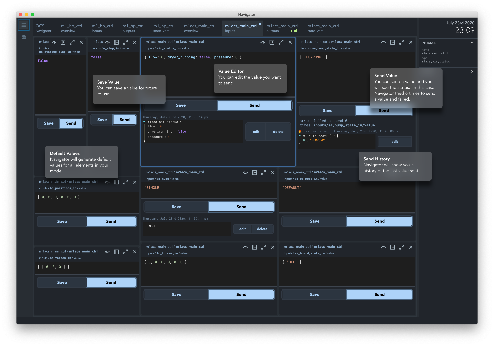

.. _ui_fwk:

UI Framework
============

The UI Framework provides a GUI toolkit for the OCS.  One of the GUI apps is called Navigator, and sometimes referred to as the "Engineering UI", as it allows you to visualize models built with OCS SDK.  You can use the Engineering UI to see the data produced and consumed by your controllers.

Navigator can run on MacOS or a Linux Desktop environment.  macOS Mojave, Catalina and CentOS 8 Desktop have been verified.

Installation
------------

To install Navigator you will need to donwload the packaged app and set up your local environment.  Downloads are available for macOS and centOS.

.. code-block:: bash

    wget http://52.52.46.32/srv/gmt/releases/navigator/centos8/ocs_navigator.AppImage
    wget http://52.52.46.32/srv/gmt/releases/navigator/macos/ocs_navigator.zip

This is a packaged binary app that you can run after you have set up your environment.  For CentOS you will need additional dependencies:

.. code-block:: bash

    dnf -y install fuse clang dbus-devel gtk3-devel libnotify-devel \
               xorg-x11-server-utils libcap-devel \
               cups-devel libXtst-devel alsa-lib-devel libXrandr-devel \
               nss-devel \
         libXScrnSaver

Setting up your enviornment
###########################

The Engineering UI uses the ``gmt_env`` if you have set that up.  If you don't have that, you'll need to set up a ``$GMT_LOCAL`` environment.  This is very similar to setting up the SDK.  

.. note::
    For bash, you'll need to edit the ``~/.bash_profile``. For zsh you'll need to edit ``~/.zshrc``.

To set up a ``$GMT_LOCAL`` environment, first designate a directory and set your ``~/.bash_profile`` or ``~/.zshrc`` environment variables.  Asumming the path is ``/home/gmto/working_dir``, then your export should look like

.. code-block:: bash
  export GMT_LOCAL=/home/gmto/working_dir

Create the following folder structure in your ``$GMT_LOCAL`` directory

.. code-block:: bash

    |-- etc
    |   |-- bundles
    |   |   |-- bundles.coffee
    |   |   |-- ocs_local_bundle.coffee
    |   |-- conf
    |-- lib
    |-- modules

The ``bundles.coffee`` should have

.. code-block:: coffee

    module.exports =
        ocs_local_bundle:   {scope: "local",  desc: "GMT OCS SDK bundle"}

The ``ocs_local_bundle.coffee`` should look like

.. code-block:: coffee

    module.exports =
        name:      "local"
        desc:      "List of local development modules"
        elements:  {}

This will give you the base parameters to load the local environment. The ``elements`` key in this example is intentionally empty. This will change as you add OCS bundles.  You will need to have corresponding model files for the bundles you define.

.. note::
    
    The bundles you define need to have corresponding webpack model files in ``$GMT_LOCAL/lib/js``.  You will need to copy these files on your own.

Now you can star the Navigator app by double clicking on the icon.  If you have done all of the above correctly you will see the starfield animation.

.. image:: navigator_images/navigator_first_run.png
  :align: center
  :alt: Navigator on first launch.

Seeing Data With Navigator
----------

The Navigator app has some parallels with server/client model.  This is an inexact comparison, however, it's a useful analogy to explain the configuration required to see your data.  The ``server`` in this case is the environment that runs your OCS controllers, adapters, services, etc.  The ``client`` is the Navigator UI which will most likely run on a separate Linux machine with full desktop graphics support or macOS.

To see data, both your client and server need to have identical models and corresponding configuration files.  While a model might describe multiple components and their relationships, a configuration file is defined for a single component at a time.  

The easiest thing to do is to copy the files you have in ``$GMT_LOCAL/lib/js/*_model.js`` and ``$GMT_LOCAL/etc/conf`` on your server to your client.  Navigator uses the same paths to discover your files.  You will then need to modify your config files as follows.

Server
######

On the machine where your components run, you will have to edit your configuration file so that it publishes data as a server.  In a configuration file the field you need to edit is ``properties.host.default_value`` with the value of `0.0.0.0` and not the loopback or server address.  In some cases this will require that you recompile your config files.

Your server should not have the firewall enabled.  To disable the firewall ``sudo systemctl stop firewalld``.

Client
######

Likewise, edit the the configuration on your client so that it points to the server IP where you're trying to see data.  You can view this address with the ``ifconfig`` command on your server.  This config will live in the ``$GMT_LOCAl/etc/conf`` directory.  Set the ``properties.host.default_value`` of the corresponding config to the valid IP of the server you're trying to connect to.

Navigator Overview
----------

You can inspect data on any part of your component the same way you do on the command line.

You can also send data.

Troubleshooting Guide
---------------------

The engineering app loads the local bundles defined in ``$GMT_LOCAL/etc/bundles`` and the webpack model files in ``$GMT_LOCAL/lib/js``.  If you enable bundles, but no corresponding model lib file exists, the UI might end up an incosistent or 'blank' state.

* **No navigation tree**: the navigation tree is rendered from the local bundles enabled in ``$GMT_LOCAL/etc/bundles``.  The bundles defined there need to exist in your ``$GMT_LOCAL/lib/js`` folder.  You can create these by running ``webpack`` on your model.
* **Incositent Navigation tree**: If you don't see a newly added (or still see a deleted element in the tree) it's because Navigator persists your menu state, so when you make changes to your bundles or edit your model files you need to manually clear the application cache.  Press ``CMD+,`` to see the Navigator preferences.  Find the `Reset application state` button and press it.  If this works, your menu will have been rebuilt and should be consistent again.
* **Blank screen**: If the UI starts with a blank screen, it's likely there's an incosistent configuration, for example, you defined a bundle, but there is no webpack version of the model in ``$GMT_LOCAL/lib/js``.  Open the Developer console and check the error message.

In some cases the cached data might have caused an error.  There are three possible ways to fix this in order of severity:

Open the app development console by selecting from the OS menu ``Developer > Toggle developer tools``.  In the developer console type ``persistor.purge()`` press `Enter` and restart the app.

If that fails,

Delete the app, and reinstall.

If that also fails, try deleting the cache directly from your disk

.. code-block:: bash

    rm -fr ~/.config/Electron 
    rm -fr ~/.config/ocs_navigator

If this does not fix your problem, it's possible that your bundle and your modules are inconsistent.  Check that what you define in ``$GMT_LOCAL/etc/bundles`` has a corresponding webpack file in ``$GMT_LOCAL/lib/js``.

* **Unresponsive UI**: in some case if the UI becomes unresponsive, press ``CMD+R`` to refresh.  If that fails to solve the problem, restart the CLI app.
* **No data**: Ensure that the ports used by the controllers to publish data are accessible through the firewall. The following will disable the firewall on CentOS:

  .. code-block:: bash

     $ sudo systemctl stop firewalld
 
