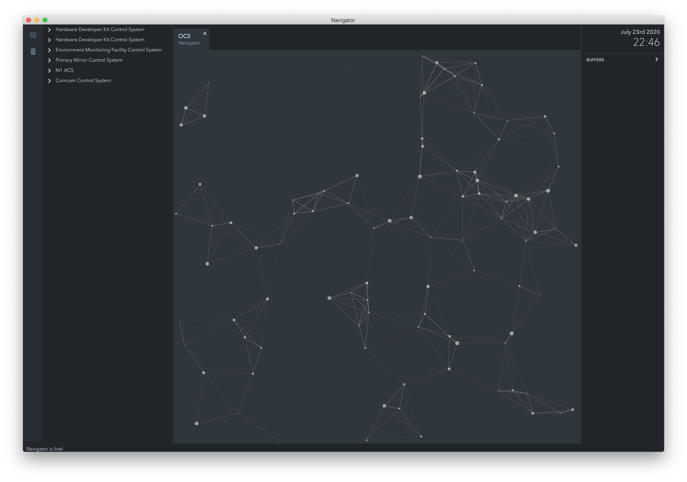
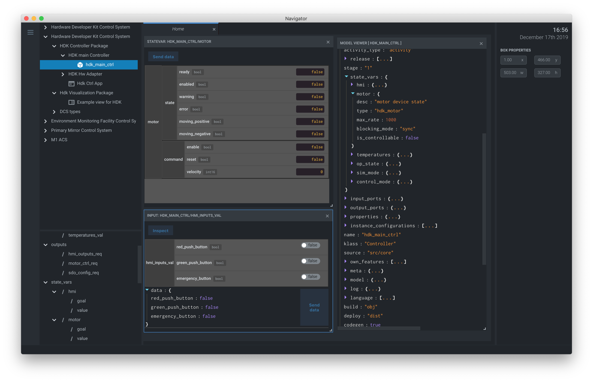
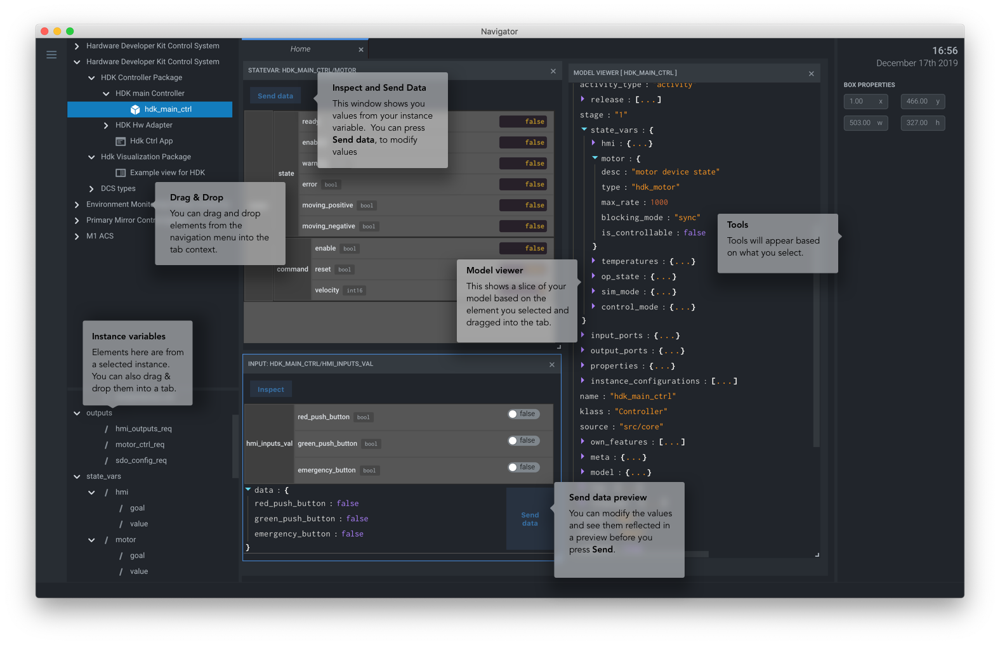

.. _ui_fwk:

UI Framework
============

.. note::
    The UI framework is currently supported on MacOS and Linux.

The UI Framework introduces a set of libraries and a windowed application that provides a GUI for the OCS.  The framework handles three primary concerns

* Rendering (drawing) elements to the screen (DOM) 
* Library of re-usable UI components that can be shared across the project
* An Engineering App that provides an interface to the OCS

Installation
------------

The UI engineering app uses the local bundles defined in ``$GMT_LOCAL/etc/bundles`` to create a visual representation of your model files' input/output ports.  If the Navigator app runs in a computer separate from where you run your components, you will need to create a minimal ``$GMT_LOCAL`` environment so that Navigator can boostrap your model and configuration files from your computer.  By convention it should be a directory in your home folder.  Once you create an ``<ocs_local>`` folder, in your shell environment file, add the following to your shell. 

.. note::
    For bash, you'll need to edit the ``~\.bash_profile``. For zsh you'll need to edit ``~\.zshrc``.

.. code-block:: bash

    # GMT Environment
    export GMT_LOCAL=/Users/<user>/<ocs_local>

where ``<user>`` is your home folder and ``<ocs_local>`` is the designated OCS local folder. For example, my environment contains

.. code-block:: bash

    # GMT Environment
    export GMT_LOCAL=/Users/aroman/ocs/

In the ``<ocs_local>`` directory, you'll need to create this folder structure and two files.

.. code-block:: bash

    |-- etc
    |   |-- bundles
    |   |   |-- bundles.coffee
    |   |   |-- ocs_local_bundle.coffee
    |   |-- conf
    |-- lib
    |-- modules

The ``bundles.coffee`` should have

.. code-block:: coffee

    module.exports =
        ocs_local_bundle:   {scope: "local",  desc: "GMT OCS SDK bundle"}

The ``ocs_local_bundle.coffee`` should look like

.. code-block:: coffee

    module.exports =
        name:      "local"
        desc:      "List of local development modules"
        elements:  {}

This will give you the base parameters to load the local environment. The ``elements`` key in this example is intentionally empty. This will change as you add OCS bundles.

.. note::
    
    The bundles you define need to have corresponding webpacke'd model files in ``$GMT_LOCAL/lib/js``.  You will need to copy these files on your own.

After you've done this, download the Mac App

* http://52.52.46.32/srv/gmt/releases/navigator/mac/ocs_navigator_app_1.7.0.zip

You can unzip the app anywhere on your MacOS file system.  Double click on the icon to run.

User Guide
----------

The navigator application contains three regions.

1. **Navigation** This area contains the navigation tree.  The tree is a representation of your model and is built from information found in your local bundles.
2. **Tabs** This area displays content in tabs.  Visualization panels will open in new tabs.
3. **Tools** This area presents context sensitive tools.  The tools are activated when you select an element in a tab.

From the navigation menu you can visually explore your model, inspect or send data to your connected instances.  

Launching Custom Panels
-----------------------

From the model navigation menu, select the ``Vis package`` you want to run and the Navigator app will open a new tab showing the panel.

Troubleshooting Guide
---------------------

The engineering app loads the local bundles defined in ``$GMT_LOCAL/etc/bundles`` and the webpacke'd model files in ``$GMT_LOCAL/lib/js``.  If you enable bundles, but no corresponding model lib file exists, the UI might end up an incosistent or 'blank' state.

* **No navigation tree**: the navigation tree is rendered off the local bundles in ``$GMT_LOCAL\etc\bundles``.  The bundles described there need to have been built with webpack.
* **Incositent Navigation tree**: Navigator persists your menu state, so when you change your bundles you need to manually reset the persistence.  Press ``CMD+,`` and press `Reset application state` button.  
* **Blank screen**: If the UI starts with a blank screen, it's likely there's an incosistent configuration.  Open the Developer console and check the error message.

In some cases the cached data might have caused an error.  There are three possible ways to fix this in order of severity:

Open the app development console by selecting from the OS menu ``Developer > Toggle developer tools``.  In the developer console type ``persistor.purge()`` press `Enter` and restart the app.

If that fails,

Delete the app, and reinstall.

If that also fails, try deleting the cache directly from your disk

.. code-block:: bash

    rm -fr ~/.config/Electron 
    rm -fr ~/.config/ocs_navigator

* **Unresponsive UI**: in some case if the UI becomes unresponsive, press ``CMD+R`` to refresh.  If that fails to solve the problem, restart the CLI app.
* **No data**: Ensure that the ports used by the controllers to publish data are accessible through the firewall. The following command should be used on the Device Control Computer to open the applicable range of ports (8122 - 8124):

  .. code-block:: bash

     $ sudo firewall-cmd --add-port=8122-8124/tcp
 
