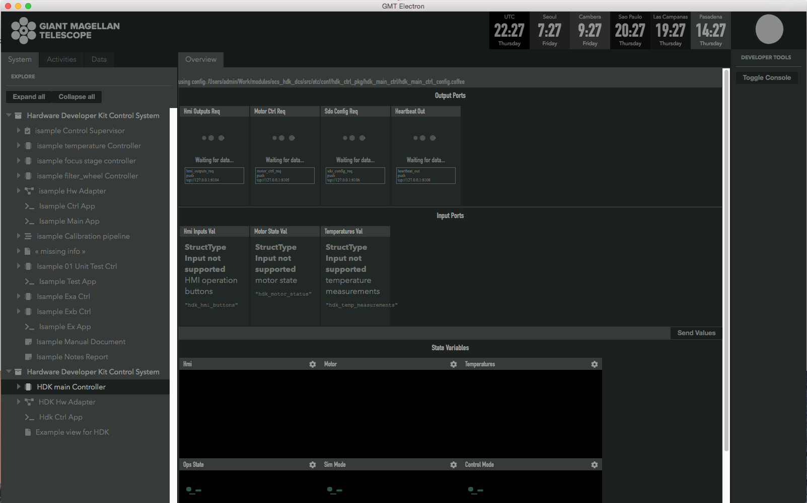
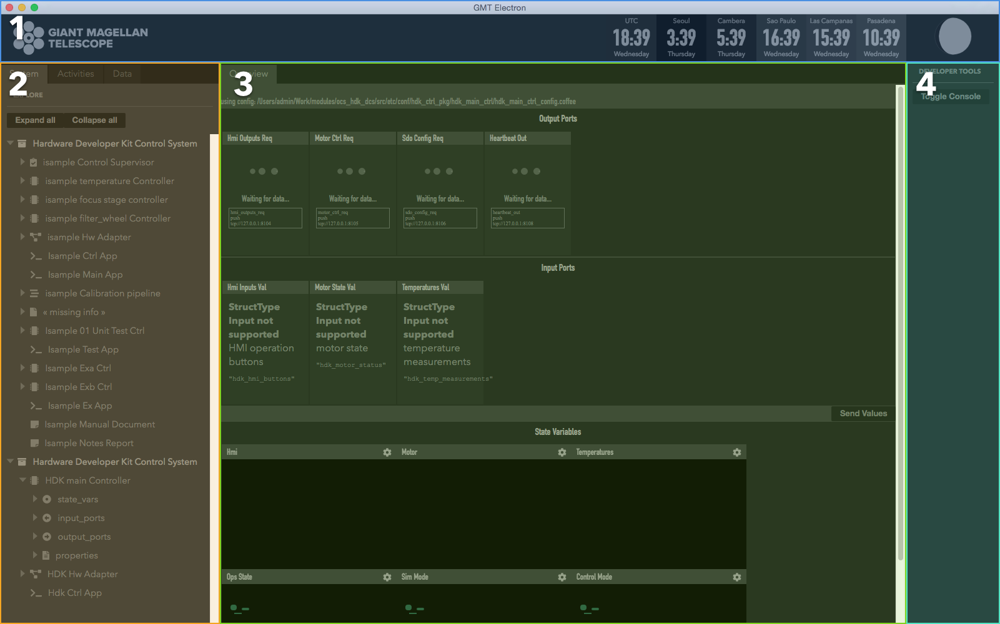

.. _ui_fwk:

UI Framework
============

.. note::
    The UI framework is currently only supported on MacOS.  Linux support will be available in future releases.

The UI Framework introduces a set of libraries and a windowed application that provides a GUI for the OCS.  The framework handles three primary concerns

* Rendering (drawing) elements to the screen (DOM) 
* Library of re-usable UI components that can be shared across the project
* An App that provides an interface to the OCS

Engineering App
---------------

The engineering application provides a GUI to the OCS model.  It is launched via the command line and it will spawn an OS window that renders the UI.

The UI engineering app uses your local bundles from ``$GMT_LOCAL/etc/bundles`` and allows you to see a visual representation of your model files' input/output ports.  For now, the Engineering app needs to run in MacOS or a Linux Desktop. 

To launch the application, run this in the command line

.. code-block:: bash

    $ navigator

This will launch the GUI as a child process of the CLI application.  To stop the GUI, stop the CLI app with ``CTRL + C``.

Configuration
-------------

The User Interface needs to be configured to connect to the correct control components to receive data. Without proper configuration, the application may look like this:

Edit the appropriate config files in the ``src/etc/conf`` folder to point to the correct IP address for input and output ports. For example,

.. code-block:: bash

    $ cd $GMT_LOCAL/modules/ocs_hdk_dcs/src/etc/conf/hdk_ctrl_pkg/hdk_main_ctrl/
    $ sed -i '' "s/172.0.0.1/172.16.10.31/g" hdk_main_ctrl_config.coffee

See the Troubleshooting section below for more help with connection issues.

Restart the Navigator application for changes to take affect.

User Guide
----------

The navigator application contains four regions.

1. **Header** The header contains timezone information, as well as a moon cycle representation.
2. **Navigation** This area contains the navigation tree.  The tree is a representation of your model and is built from information found in your local bundles.
3. **Context** Items selected in the tree will display here.  Currently, it will display a representation of your model's input/output ports and state variables.  
4. **Developer tools** This area is reserved for developer tools.  The `Toggle Console` button will show the developer console.

.. note::
    The **Context** area will optimistically render your model.  Not all model data can be currently rendered. Some items like `properties` and detailed port views are currently not supported.

.. warning:: 
    Input ports are rendered as data inputs based on the type data encoded in your model.  The `StructType` input is not yet supported.   When you press the ``Send Value`` button the app will attempt send the data in *all* the input fields to each respective port defined.  

Launching Custom Panels
-----------------------

The ``navigator`` application can also launch custom panels that are defined in a DCS' `*_vis_pkg` folders.  When defined, it's possible to launch standalone panels with the following parameters

.. code-block:: bash

    $ navigator --panel emf_custom_weather_view --port 9098

The ``--panel`` flag specifies an exported panel in some vis package.  The ``--port`` flag is currently required to avoid port collisions (for now).

The engineering app reserves port ``9199``.  Custom panel launches of the application need to specify a different port for each instance.

.. note::
    When running a custom panel, only the **Header** and **Context** regions will be shown.  The panel content is rendered in the **Context** region.

Creating Custom Panels
----------------------

The following tutorial uses the HDK module to step through the process of creating a simple, and then a more complex custom UI panel. In some cases, the files and folders created in the tutorial already exist in the repository.

Updating the model
^^^^^^^^^^^^^^^^^^

The UI Framework needs to notified of the existence of custom UI panels when loading the model. This is currently achieved by adding a panel definition in the model and rebuilding it with ``webpack``.

To create a custom UI panel to load in the UI, a vis package is required.  We'll first register this package in the model, then export the code that will be run by the UI framework.

.. code-block:: bash

    $ cd $GMT_LOCAL/modules/ocs_hdk_dcs/model
    $ mkdir hdk_vis_pkg
    $ touch hdk_custom_view.coffee

Edit ``hdk_custom_view.coffee``, and add the following code

.. code-block:: coffee

    Panel "hdk_custom_view",
        info: 'Example view for HDK'

Now edit ``$GMT_LOCAL/modules/ocs_hdk_dcs/model/hdk_dcs_def.coffee`` with following

.. code-block:: coffee

    module.exports =
        elements:
            hdk_ctrl_pkg:
            # Leave unchanged.

            # Add this
            hdk_vis_pkg:
                elements:
                    hdk_custom_view:  { language: ['coffee'], build: 'obj', deploy: 'dist',    codegen: false, active: true}

Finally edit ``$GMT_LOCAL/modules/ocs_hdk_dcs/model/hdk_dcs_ld.coffee`` to require the new vis package coffee file.

.. code-block:: coffee

    ...
    require './hdk_vis_pkg/hdk_custom_view'

    module.exports = require './hdk_dcs_def'

This step is to register a vis package in the OCS model.  This package is only visible after you rebuild your model with ``webpack`` and re-launch the navigator app.

.. note::
    Future releases will make more use of these model definition files.  For now a single `Panel` definition is required for the vis_pkg to become visible to the UI framework.

Simple 'Hello World' panel
^^^^^^^^^^^^^^^^^^^^^^^^^^

Now that your vis package is visible to the model, you need to write some UI code.

.. code-block:: bash

    $ cd $GMT_LOCAL/modules/ocs_hdk_dcs/src/coffee
    $ mkdir hdk_vis_pkg
    $ touch hdk_vis_pkg.coffee

The ``$GMT_LOCAL/modules/ocs_hdk_dcs/src/coffee/hdk_vis_pkg/hdk_vis_pkg.coffee`` file is imported by the Engineering application when you launch it with a ``--panel`` parameter.  There is nothing in that file yet, so we'll first create a 'Hello World' example.

.. code-block:: bash

    $ cd $GMT_LOCAL/modules/ocs_hdk_dcs/src/coffee/hdk_vis_pkg
    $ touch hello.coffee

Now edit the ``hello.coffee`` and add the following

.. code-block:: coffee

    import { Panel } from 'ocs_ui_fwk/ui'

    View = () =>
        <Panel>
            Hello World!
        </Panel>

    export default View

That effectively renders a 'Hello World' message in a UI panel.  This is still not visible the the Engineering app, for that you'll need to export that `View` in the ``hdk_vis_pkg.coffee`` file

Edit ``$GMT_LOCAL/modules/ocs_hdk_dcs/src/coffee/hdk_vis_pkg/hdk_vis_pkg.coffee``

.. note::
    When you export ``default`` modules, the name you use to import does not matter.  This is why the declared `View` can be exported as ``View`` and imported as ``HelloWorld``.

.. code-block:: coffee

    import HelloWorld from './hello'

    views = [
        nav: 'hdk_dcs/hdk_hello_world_view'
        type: 'hdk_hello_world_view'
        Component: HelloWorld
    ]

    export default views

.. note::
    The ``type`` key is used by the navigator app to locate your exported `View`.  The ``--panel`` parameter in the cli app needs to be the same as the ``type`` value.  The ``nav`` key provides a navigation tree hint that for the general engineering app.  This way your panel is exposed both as a custom panel, and is also read by the engineering app.

It should now be possible to see this view by running the ``--panel`` flag on the ``navigator`` cli app.

.. code-block:: bash

    $ navigator --panel hdk_hello_world_view --port 9197

Complex panel
^^^^^^^^^^^^^

That example is to get your feet wet, but you'll want to render more complex views of your components.  The UI framework provides an abstraction that parallels the `step` function of your components.  This abstraction provides the data you expose through your output ports and state var values, and provides a way to send values to input ports and state var goals.

First, let's create the `Step` rendering function.  We will create a step function for the ``hdk_main_ctrl`` model.  The data that the step render function exposes comes from the ``hdk_main_ctrl.coffee`` model.

.. code-block:: bash

    $ cd $GMT_LOCAL/modules/ocs_hdk_dcs/src/coffee/hdk_vis_pkg
    $ touch hdk_main_ctrl_step.coffee

Now edit ``hdk_main_ctrl_step.coffee``, and add the following boilerplate code.  Note that if you decide to create a step render function for another component you'll need to edit only a few lines of boilerplate.  Mainly the config path and the component name.

.. code-block:: coffee

    import { Store } from 'ocs_ui_fwk/ui'

    config = require '../../etc/conf/hdk_ctrl_pkg/hdk_main_ctrl/hdk_main_ctrl_config'

    dcs = 'hdk_dcs'
    component = 'hdk_main_ctrl'

    # Default options
    options =
        type: "@#{dcs.toUpperCase()}/#{component.toUpperCase()}"
        key: "#{dcs}/#{component}"

    # Initialize ports to start data streams
    Store.initPorts config, options

    # Create step function view renderer
    Step =
        Render: Store.renderStep config, options

    export default Step

This creates the step render function, but you'll need to write a separate view to render that content.

.. note::
    This loads the configuration file that's usually auto-generated when you build your model.  The configuration needs to have accessible url definitions.  In some cases that means having opened firewall ports when you're component is running on a separate machine.  The navigator app reads those url's to receive and render data.

    To open a firewall port in Fedora, you can run ``sudo firewall-cmd --add-port=8122-8124/tcp`` where ``8122-8124`` is a port range you want to open.

The `Step.Render` function maps the model declared in `hdk_main_ctrl` to a renderable `View`.  The function exposes ``input_ports``, ``output_ports`` and ``state_vars`` declared in the model.  Note that a combination of the ``hdk_main_ctrl_config`` and ``hdk_main_ctrl`` model is used to generate this function.  To see an example of this in use, we'll need to create a separate view.

In this example, we'll visualize the digital outputs to the control lights.  This is the ``hmi_outputs`` in the ``hdk_main_ctrl`` model.  ``hmi_outputs`` is defined as an output port of type ``hdk_hmi_leds``.  In the DCS types, the ``hdk_hmi_leds`` type is a ``StructType``.

.. note::
    The ``hmi_outputs`` url needs to be an accessible `TCP` port.  In most cases, you should define the URL explicity as the IP address of the machine.  So ``url: 'tcp://127.0.0.1:8104'`` should be ``url: 'tcp://10.20.10.12:8104'`` when your machine's IP is ``10.20.10.12``.  Additionally, the navigator app can only subscribe to ``pub`` protocols, so your port should be set to ``protocol: 'pub'``.  Reading telemetry from other protocols is planned for a future release.

.. code-block:: bash

    $ cd $GMT_LOCAL/modules/ocs_hdk_dcs/src/coffee/hdk_vis_pkg
    $ touch hdk_main_ctrl_view.coffee

Now edit ``hdk_main_ctrl_view.coffee`` with the following boilerplate:

.. code-block:: coffee

    import { Panel, Widget, Box } from 'ocs_ui_fwk/ui'
    import HDKMain from './hdk_main_ctrl_step'

    View = () =>
        <Panel>
            <HDKMain.Render>
                {({state_vars}) =>
                    #...rendered views go here
                    <Panel>This is rendered from the HDKMain.Render step function</Panel>
                }
            </HDKMain.Render>
        </Panel>

    export default View

In the above example, you get a ``Render`` function from the imported ``hdk_main_ctrl_step`` that we declared earlier.  The ``Render`` function gives you ``state_vars`` as an input, and expects a renderable `View` as an output.  The ``state_vars`` map directly to the model, so we can expect the ``hmi`` data to be included as part of the ``state_vars`` data.  For example, if we wanted to get the value of the pilot light, we can use the safe access operator ``state_vars?.hmi?.output?.pilot`` to retrieve that value.

.. code-block:: coffee

    <HDKMain.Render>
        {({state_vars}) =>
            #...rendered views go here
            <Panel>
                <Box>Pilot light</Box>
                <Box>
                    {state_vars?.hmi?.output?.pilot.toString()}
                </Box>
            </Panel>
        }
    </HDKMain.Render>

.. note::
    We use the Coffeescript existential operator ``?`` so that we don't access ``undefined`` values and crash.  This may be the case when there are errors in your model, or the data streams are not available to the UI.

You won't be able to load this panel until you export it in ``hdk_vis_pkg.coffee``

.. code-block:: coffee

    import HelloWorld from './hello'
    import HDKMainView from './hdk_main_ctrl_view'

    export default [
        nav: 'hdk_dcs/hdk_hello_world_view'
        type: 'hdk_hello_world_view'
        Component: HelloWorld
    ,
        nav: 'hdk_dcs/hdk_main_ctrl_view'
        type: 'hdk_main_ctrl_view'
        Component: HDKMainView
    ]

You can now run it with the ``--panel`` flag on the ``navigator`` cli app, with the type.

.. code-block:: bash

    $ navigator --panel hdk_main_ctrl_view --port 9198

.. warning::

    The navigator app allows you to run instances of multiple panels at the same time.  However, you will need to specify a different ``--port`` for each instance to avoid port collision errors.  Also, note that the navigator app will reuse the internal data server for multiple instances, so if you close the initial instance, the data server may become unavailable for the other panels.

You should now see `true` or `false` string rendered on the screen indicating the pilot light status.  But the UI can render more than strings.  A more extensive example that shows the status of the motor and LED lights can be found in the HDK vis package ``https://github.com/GMTO/ocs_hdk_dcs``.

Troubleshooting Guide
---------------------

The engineering app loads the local bundles defined in ``$GMT_LOCAL/etc/bundles``.  It currently uses the model generated config files to read data for your package.  Those config files are created in ``$GMT_LOCAL/modules/<your_module>/src/etc/conf/<your_package>_pkg/<component>_config.coffee``; it's useful to see what's in those configs when troubleshooting data availability issues.  The availability of data to the UI largely depends on those config files.  The values generated will depend on how you write your model, but a sample of a config file might look like 

    .. code-block:: coffee

        module.exports =
            properties:
                uri: { name: 'uri', default_value: 'gmt://hdk_dcs/hdk_main_ctrl/hdk_main_ctrl' , type: 'String', desc: 'Uri path for the component' }
                # other fields ommited

            state_vars:
                hmi: { name: 'hmi',   }
                motor: { name: 'motor',   }

            input_ports:
                hmi_goal:            { name: 'hmi_goal',              protocol: 'pull',  url: 'tcp://127.0.0.1:8116', blocking_mode: 'async', max_rate: 1000,  nom_rate: 1     }
                motor_goal:          { name: 'motor_goal',            protocol: 'pull',  url: 'tcp://172.16.10.31:8117', blocking_mode: 'async', max_rate: 1000,  nom_rate: 1     }

            output_ports:
                hmi_value:           { name: 'hmi_value',             protocol: 'pub',   url: 'tcp://127.0.0.1:8122', blocking_mode: 'async', max_rate: 1000,  nom_rate: 1     }
                motor_value:         { name: 'motor_value',           protocol: 'pub',   url: 'tcp://172.16.10.31:8123', blocking_mode: 'async', max_rate: 1000,  nom_rate: 1     }

When troubleshooting it's important to note the `protocol` and the `url` keys for a given port.  For example the ``hmi_value.url`` value is ``tcp://127.0.0.1:8122`` this means you're trying to connect to port number ``8122`` on the address ``127.0.0.1`` (which is typically your local machine).  Whereas the ``motor_value.url`` is trying to connect to a different computer with an IP address ``172.16.10.31`` on port number ``8123``. 

If the computer at ``172.16.10.31`` is firewalled and not allowing connections to port ``8123``, you will not be able to see data.  You will need to allow incoming connections to that port.  Likewise, if your component is running at the computer at ``172.16.10.31`` and you are trying to read data from ``127.0.0.1``, you will not see any data.  You will need to change the IP to match the computer where your component is running.

Additionally, the UI can only read data from ports configured with the ``pub`` protocol.

If you make changes to the config file, you will need to restart the command line app; you can do this by pressing ``CTRL + C``.

* **MacOS - nvm command not found**: If, after installing nvm, the command ``nvm install`` fails with the message, ``command not found``, check the ``~/.bash_profile`` file to ensure that it contains a command for loading nvm. The .bash_profile file should contain the following lines:

  .. code-block:: bash

      export NVM_DIR="$HOME/.nvm"
      [ -s "$NVM_DIR/nvm.sh" ] && \. "$NVM_DIR/nvm.sh"  # This loads nvm
   
* **Unresponsive UI**: in some case if the UI becomes unresponsive, press ``CMD+R`` to refresh.  If that fails to solve the problem, restart the CLI app.  You can stop the CLI app with ``CTRL+C``.
* **No navigation tree**: the navigation tree is rendered off the local bundles in ``$GMT_LOCAL\etc\bundles``.  The bundles described there need to have been built with webpack.
* **No data**: Ensure that the ports used by the controllers to publish data are accessible through the firewall. The following command should be used on the Device Control Computer to open the applicable range of ports (8122 - 8124):

  .. code-block:: bash

     $ sudo firewall-cmd --add-port=8122-8124/tcp
 

