.. _virtual_machine:

Installing a Virtual Machine
============================

A Virtual Machine allows for the creation of a development environment within
any host computer, and provides a way to quickly start developing without the
need for specialized equipment.

VirtualBox is a free application that can quickly and easily create Virtual
Machines capable of running most operating systems. This is a guide for setting
up a Virtual Machine for GMT SWC development.

.. note::
  Needless to say, there are situations where a Virtual Machine should not be
  used, for example when the system requires physical interfaces that cannot be
  easily simulated in a Virtual Environment.

Download Virtual Box
--------------------

The latest versions of VirtualBox can be found here:
`<https://www.virtualbox.org/wiki/Downloads>`_

Download and install the correct version, depending on which host machine will
be used. For the purposes of this guide, we will be installing VirtualBox
version 5.1.20, for use on OS X.

Install VirtualBox
------------------

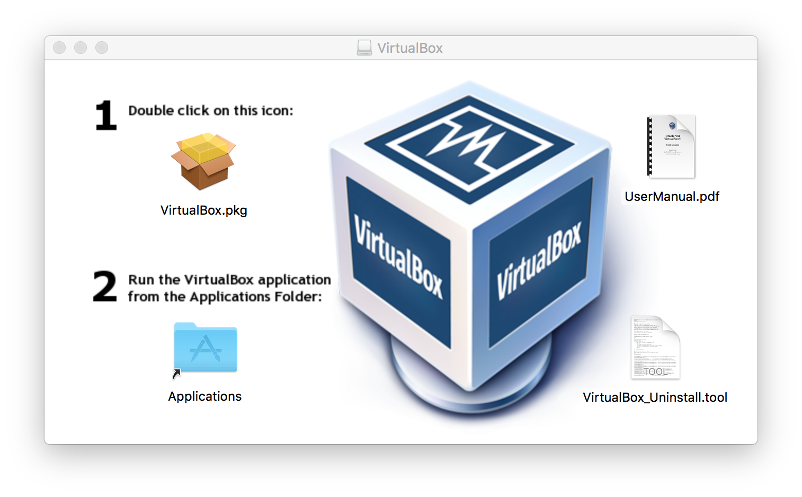

Click on the VirtualBox.pkg image to install.

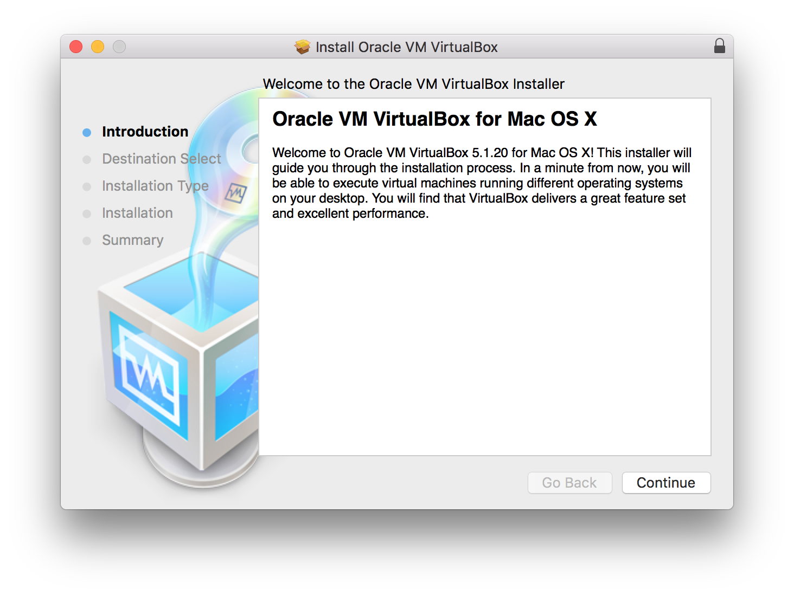

Click *Continue* to install using defaults.

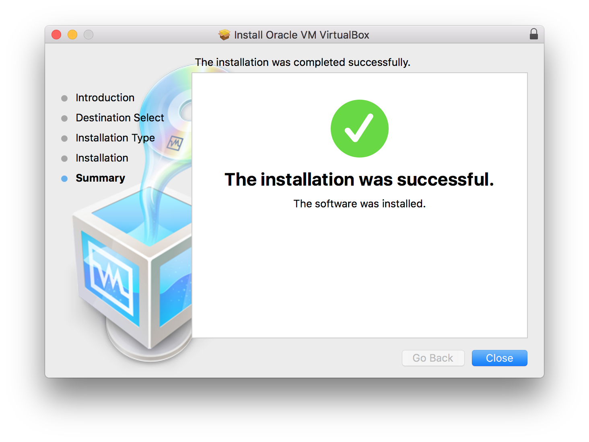

Create a Virtual Machine
------------------------

Run the application

.. image:: images/ss04_virtualbox_welcome.png
  :align: center
  :scale: 70 %
  :alt: VirtualBox Application Window

Select *New*

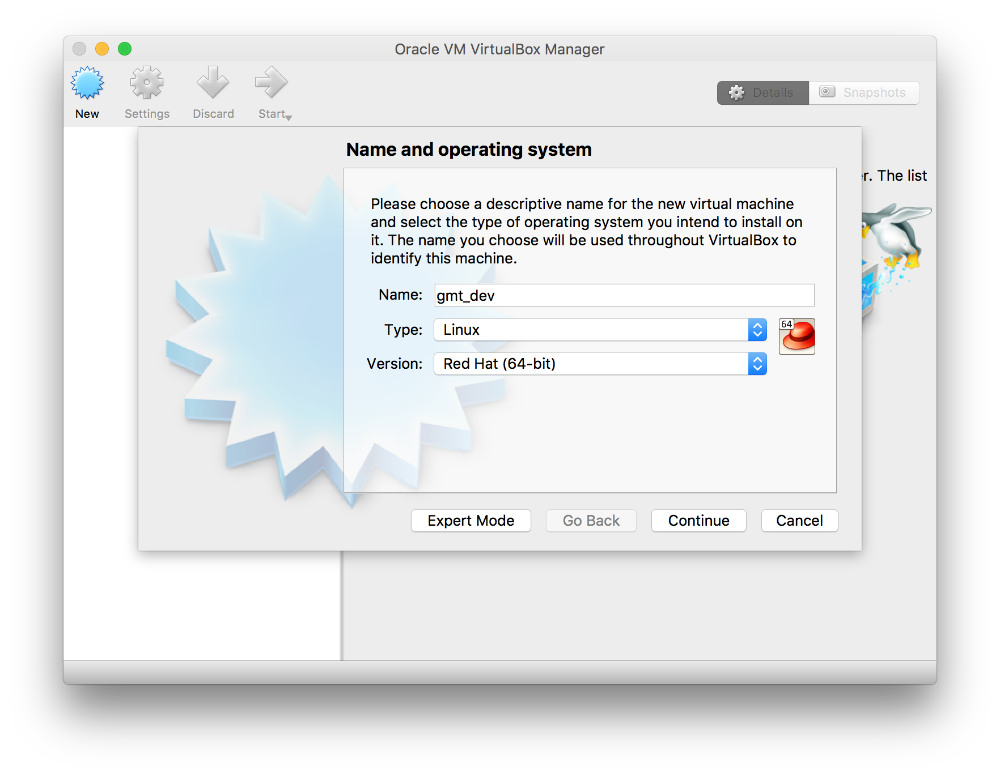

Choose a descriptive **Name** for the Virtual Machine and select the **Type**
as *Linux* and the **Version** as *Fedora (64-bit)*.

Select *Continue* to proceed.

.. image:: images/ss06_new_memory_size.png
  :align: center
  :scale: 70 %
  :alt: Memory Size

The amount of memory allocated to the Virtual Machine can be varied depending
on how much memory is available to the host machine and how heavily the
Virtual Machine will be utilized. At this stage, *2 GB* is more than sufficient.
It can be changed after the Virtual Machine has been set up, if necessary.

Select *Continue* to proceed.

.. image:: images/ss07_new_hard_disk.png
  :align: center
  :scale: 70 %
  :alt: Hard Disk

Select **Create a virtual hard disk now**, to set up a hard drive.
This will be a file on the host machine that can dynamically resize based
on demand, up to a specified maximum value.

Select *Create* to proceed.

.. image:: images/ss08_new_hard_disk_type.png
  :align: center
  :scale: 70 %
  :alt: Hard Disk File Type

Select the default, **VDI (VirtualBox Disk Image)**, and then click
*Continue* to proceed.

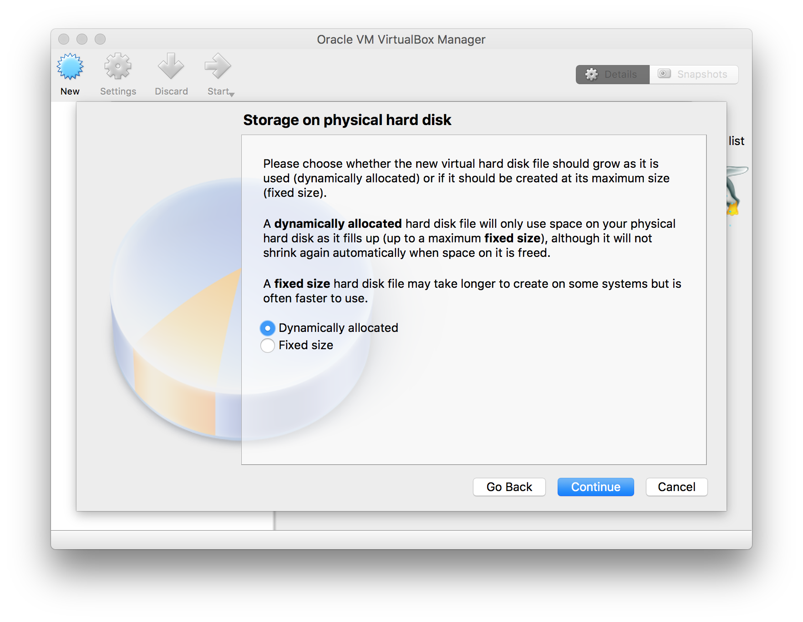

Select the default, **Dynamically allocated**, and then click
*Continue* to proceed.

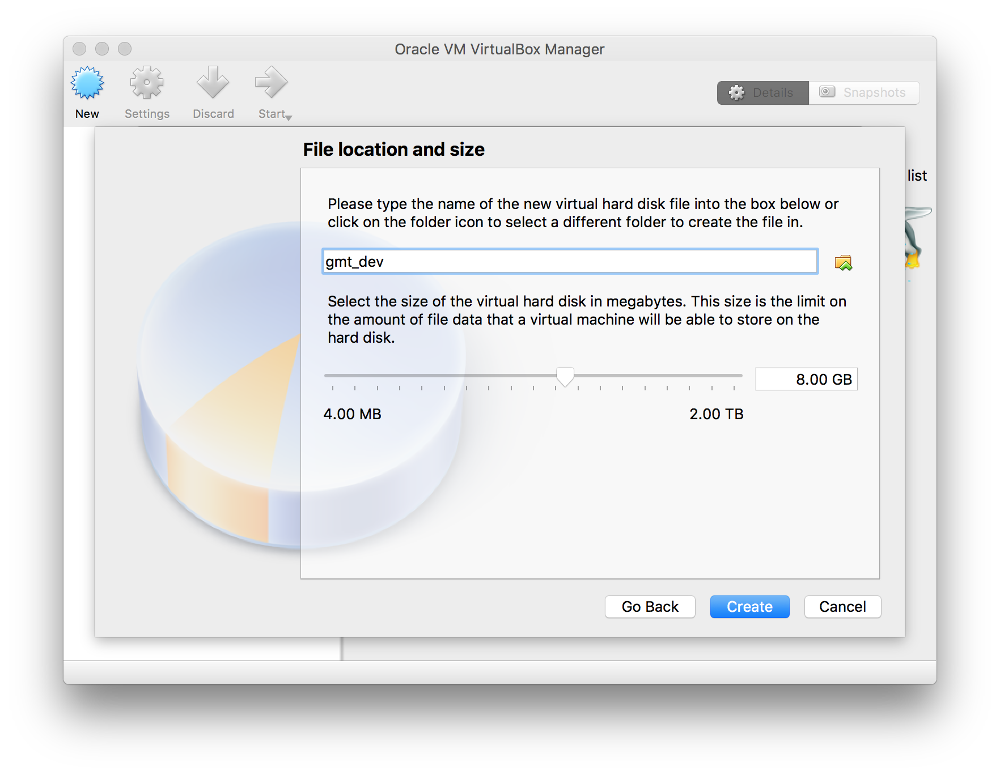

The amount of disk space allocated to the Virtual Machine can be varied
depending on how much disk space is available to the host machine and the
hardware requirements of the Virtual Machine.
The host machine will only be impacted by the actual size of the virtual
machine file system because the virtual drive space is allocated dynamically.
At this stage 20 GB is sufficient.
The minimum capacity for the SWC development machine is 5 GB.

Select *Create* to proceed.

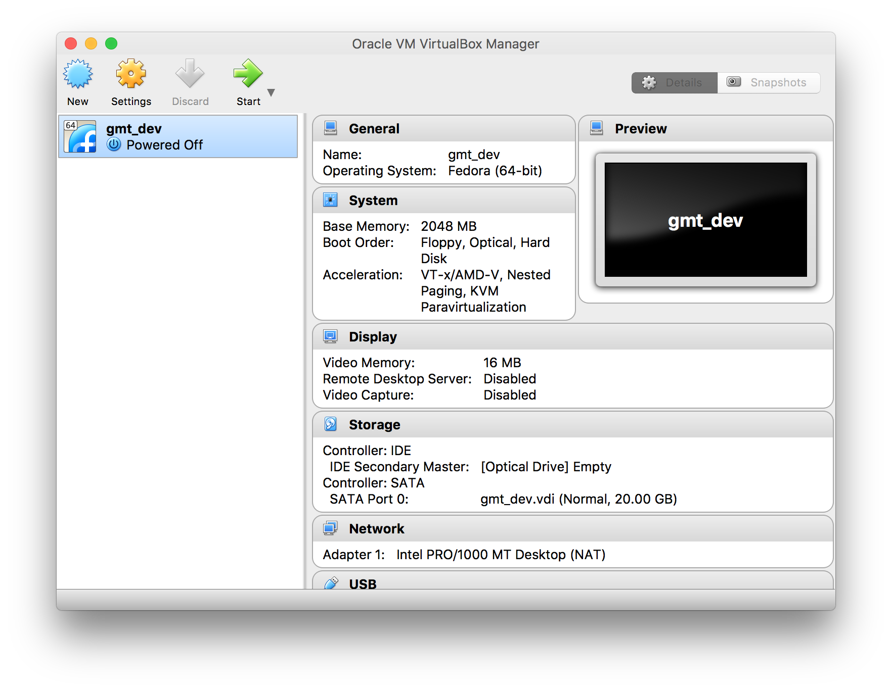

The Virtual Machine is now set up and ready to use.
The system properties of the VM can be changed whenever it is turned off
by selecting the VM and clicking on Settings.

Configure Network Settings
--------------------------

To allow the virtual machine to access the internet, we need to enable access
to the network interface of the host machine. The exact settings will depend
on the network topology, so some experimentation may be required to make it
work.

For more detailed information on Virtual Networking, consult the official
`documentation <https://www.virtualbox.org/manual/ch06.html>`_

Network Address Translation (NAT)
~~~~~~~~~~~~~~~~~~~~~~~~~~~~~~~~~
This is the default networking mode in VirtualBox.
The Virtual machine will be placed on a private internal network that is not
directly accessible from the outside. Instead, the networking engine will map
traffic through the host interface, making it appear as though the packets
originated from the VirtualBox application on the host IP address.

This mode is simple to configure, but it has the drawback that it is not
useful when the Virtual machine must be accessed from the outside, for
example to make ssh connections to it, or to have two components that must interchange data
deployed in two different machines. In these cases, the Bridged Adapter
networking (see next paragraph) should be used.

Bridged Adapter
~~~~~~~~~~~~~~~
Bridged networking allows VirtualBox to intercept data from the physical
network and create a new virtualized network interface. The Virtual Machine
will have its own IP Address and will be accessible from the outside.

When connected to the GMTO network, use this configuration.

Select the VM and click on *Settings*, then select the *Network* icon on
the top row.

.. image:: images/ss12_network_settings.png
  :align: center
  :scale: 70 %
  :alt: Network Adapter Settings

Enable Network Adapter 1 and set it to be **attached to** *Bridged Adapter*
with **Name** the same as the network adapter used by the host machine to
connect to the internet. In this case, it's the wireless adapter *en0*.
The settings under **Advanced** can remain on defaults.

Select *OK* to save settings and close the dialog.

Host-only networking
~~~~~~~~~~~~~~~~~~~~
Host-only networking can be though as a hybrid between the Bridged
and the internal networking modes. With this setup, the Virtual Machines will
be able to communicate between them, and also to the host. However, the
Virtual Machines will not be able to communicate to the outside world. Therefore,
it will be possible to connect to the virtualized machines using ssh from the
host that is running them or to have several Virtual Machines in the same host
with components that share data between these Virtual Machines, but it will not
be possible to do the same with other hosts.

Download the iso image
----------------------

Before running the virtual machine for the first time, use the instructions in
:ref:`installation` to download the iso image that will be used to install the
Fedora operating system. Instead of creating a bootable USB drive, the iso image
will be directly loaded into the Virtual Optical Drive for installation.

Run the Virtual Machine
-----------------------

Double-click the VM in the left pane or select the VM and click "Start".

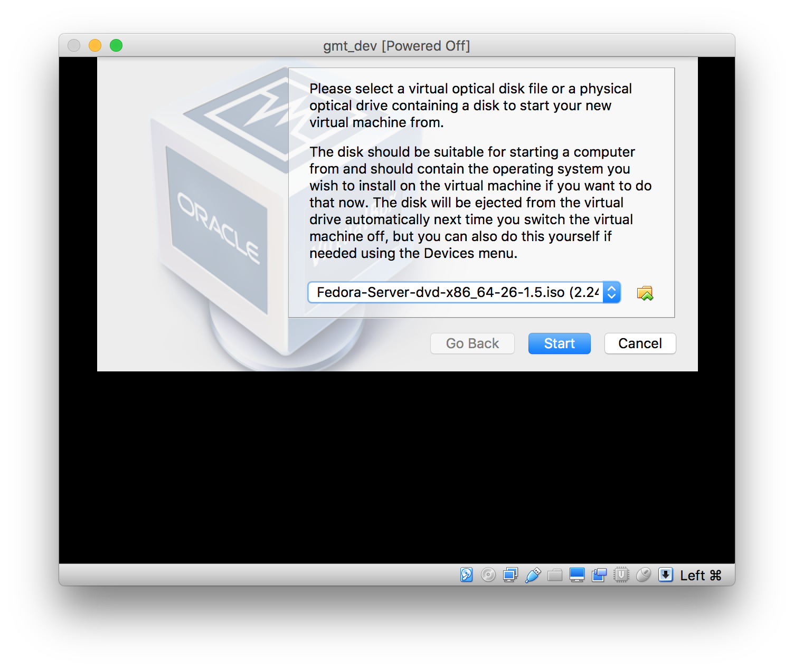

Browse to the *Fedora-Server-dvd-x86_64-26-1.5.iso* file downloaded before and click *Start*.
This will mount the iso into a Virtual Optical Drive and select it as the boot
device.

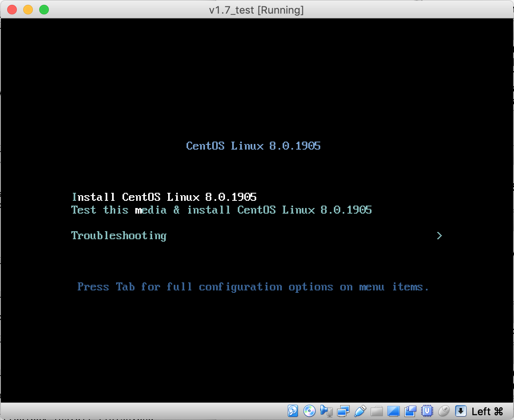

Select *Install Fedora 26* and follow the instructions in :ref:`anaconda_install` to install
the operating system. Ensure that the boot partition is set to File System *ext4* for the RT kernel
to work.

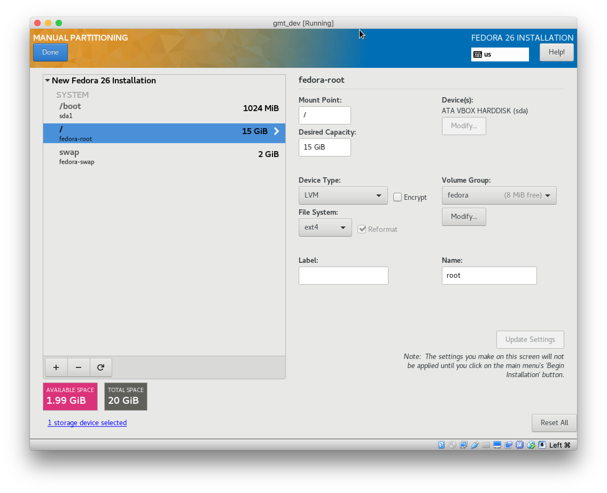

.. note::
  At this point it is useful to note that when you click on the Virtual Machine
  window, the keyboard and mouse is automatically captured for use by the guest.
  The Host-key, by default ``Left Command`` on OS X, will release the mouse and keyboard
  for use by the host.  The status is shown by the mouse and arrow icons on the
  bottom-right of the screen alongside a reminder of which key has been
  configured as the host key.

  To change to host key, select **VirtualBox VM -> Preferences** from the
  application control bar. Select the **Input** tab and edit the value next
  to the *Host Key Combination field*.

  .. image:: images/ss15_host_key_configuration.png
    :align: center
    :scale: 70 %
    :alt: Host Key Configuration

Wait for the installation to complete and selet *Reboot* when done.

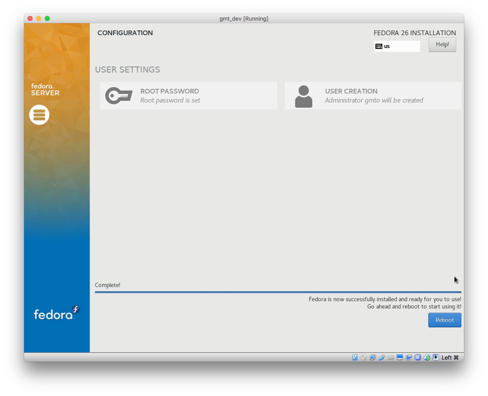

Close the window to power off the Virtual Machine.

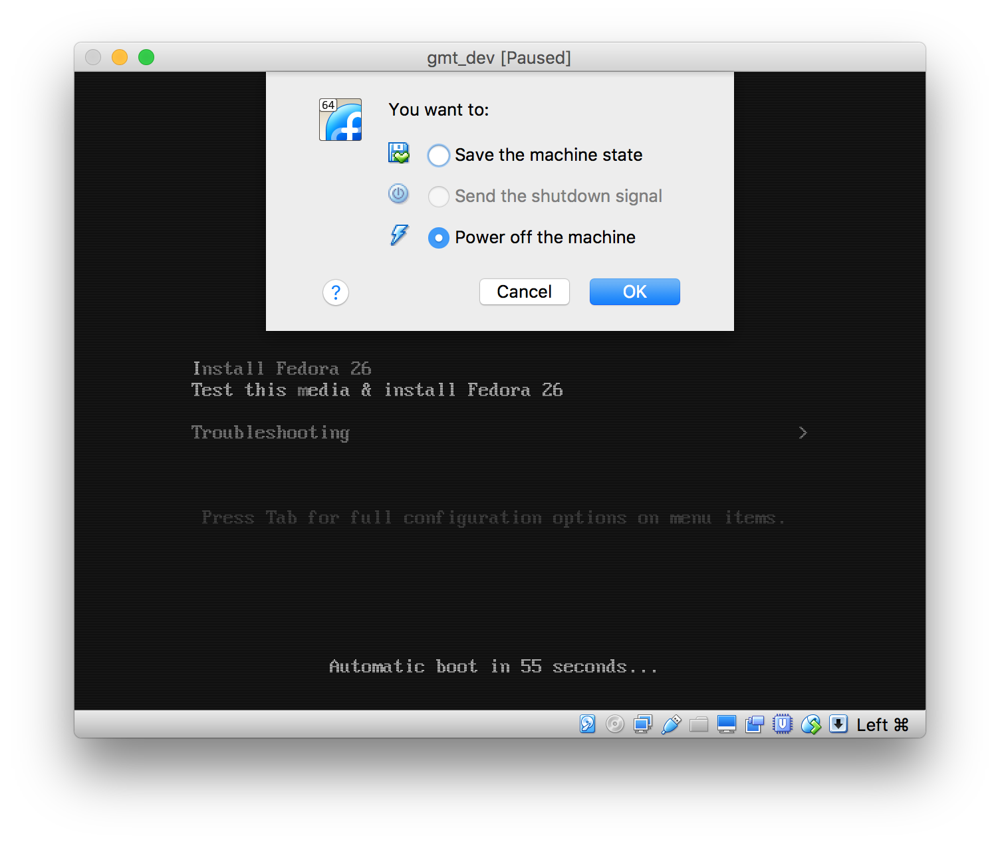

In the Storage settings panel, click on **[Optical drive]** and select
**Remove disk from virtual drive**

Start the Virtual Machine back up. The system will now boot off its own hard drive instead of the
installation disk.

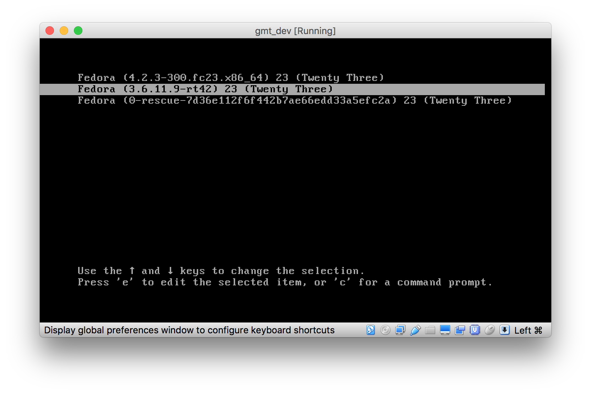

Finish the operating system configuration and SDK installation process outlined
in :ref:`installation`.

The system is now ready to use for development.

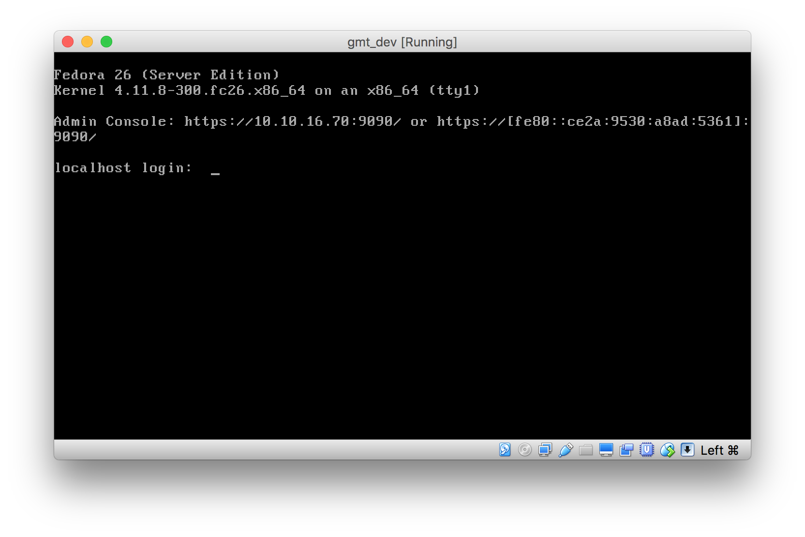

Helpful Tips using VirtualBox
-----------------------------

**Multiple Terminals**

By default, the virtual machine will start the terminal in tty1.
To switch to other terminals use ``fn-alt-<Fkey>``.

+--------------+---------------+
| tty1         | fn-alt-F1     |
+--------------+---------------+
| tty2         | fn-alt-F2     |
+--------------+---------------+
| tty3         | fn-alt-F3     |
+--------------+---------------+
| etc.         |               |
+--------------+---------------+

Multiple terminals can be used at the same time.

.. note::
  Environment variables that are temporarily set using the *export* command will
  only be set on the current terminal. If there are multiple terminals open,
  either export the variable individually on all terminals or permanently set the
  environment variables in the appropriate bash configuration files.

**Scrolling**

To scroll up in the terminal, use ``fn-shift-<up arrow>`` and
``fn-shift-<down arrow>``.

VirtualBox Guest Additions (Optional)
-------------------------------------
It's often useful to be able to share files and folders between the host
machine and the virtual machine. To enable this functionality, VirtualBox
requires **Guest Additions** to be installed. This process is optional.

First, we need to update the kernel and existing packages

  .. code-block:: bash

    $ sudo yum update

Log out and shut down the virtual machine.
Restart the virtual machine and boot with the latest kernel
*(for example Fedora 4.8.13-100.fc23.x86_64)*

.. image:: images/ss22_kernel_update.png
  :align: center
  :scale: 70 %
  :alt: Boot with latest Kernel

Install additional packages

  .. code-block:: bash

    $ sudo yum install bzip2
    $ sudo yum install kernel-devel

With the Virtual Machine running, select
**Devices -> Insert Guest Additions CD Image...** on the application control bar.

Now, find the device ID assigned to the optical drive containing the
Guest Additions CD image.

  .. code-block:: bash

    $ blkid

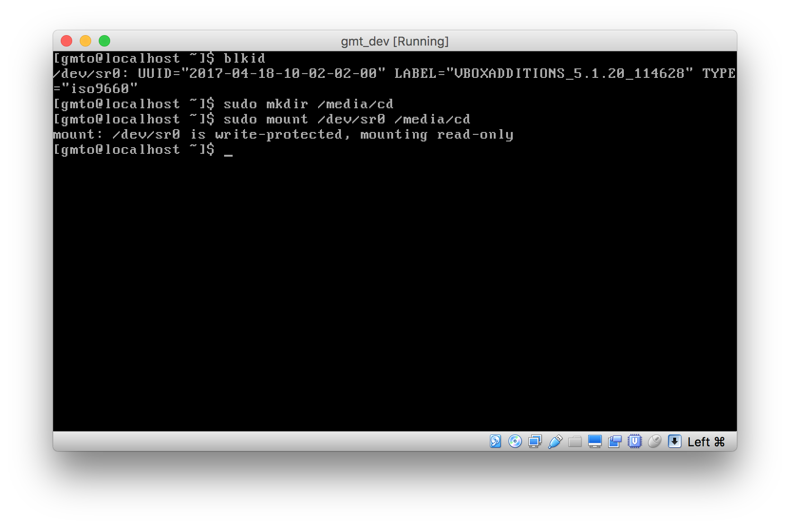

In this case, the device ID is ``/dev/sr0``.

Create a folder under */media* and use it to mount the CD rom.

  .. code-block:: bash

    $ sudo mkdir /media/cd
    $ sudo mount /dev/sr0 /media/cd

Install VirtualBox Guest Additions on the guest machine:

  .. code-block:: bash

    $ cd /media/cd
    $ sudo ./VBoxLinuxAdditions.run install

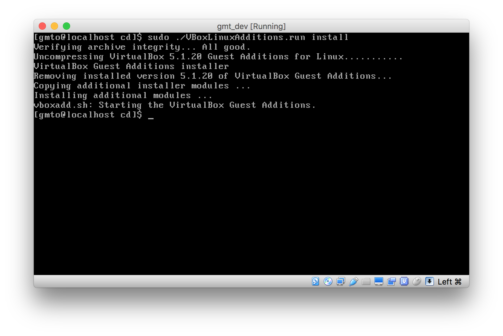

Create a shared folder on the host.

Select **Devices -> Shared Folders -> Shared Folder Settings...**

Click the *Add* icon on the right-hand side, select the *Folder* to use on the
host machine and give it a name.

Select "Auto-mount" to automatically link the folders at start-up and
"Make Permanent" to create a machine folder and not a temporary folder.

.. image:: images/ss25_shared_folder.png
  :align: center
  :scale: 70 %
  :alt: Configuring a Shared Folder

Click *OK* to save the settings.

Restart the Virtual Machine. The shared folder will be mounted at ``/media/sf_share``.

For easy folder access, add the current user to the vboxsf group:

  .. code-block:: bash

    $ sudo usermod -aG vboxsf gmto

You may need to log out and in again for the changes to take effect.

If you'd like to mount the folder manually, ensure that the "Auto-mount"
setting is not selected. Then, create a folder in the virtual machine to use,
for example ``~/share``.

  .. code-block:: bash

    $ cd ~
    $ mkdir share
    $ sudo mount -t vboxsf share ~/share

Where "share" is the name given to the folder during configuration,
potentially matching the folder name on the host and "~/share" is the
location of the folder on the virtual machine.

In this case, the gmto user does not need to be added to the vboxsf group to
allow full access to the folder.

Troubleshooting
---------------

Logging Service
~~~~~~~~~~~~~~~

If there is an issue starting the logging service, check that the mongo DB
process is running and try to restart it.

    .. code-block:: bash

      $ systemctl status -l mongod
      $ sudo systemctl restart mongod

If the problem persists, check the log file for information on why mongod is unable to start

    .. code-block:: bash

      $ sudo less /var/log/mongodb/mongod.log

If, for example, the error *Insufficient free space for journal files* is shown in the log,
it can be fixed by editing the mongod configuration file to set *smallfiles = true*.
This may be the case if a smaller hard drive size was selected for a virtual machine.

    .. code-block:: bash

      $ sudo vim /etc/mongod.conf

Restart the server and check the status again.

    .. code-block:: bash

      $ sudo systemctl restart mongod
      $ systemctl status -l mongod

:ref:`[back to top] <virtual_machine>`
